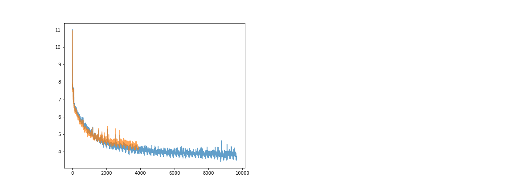
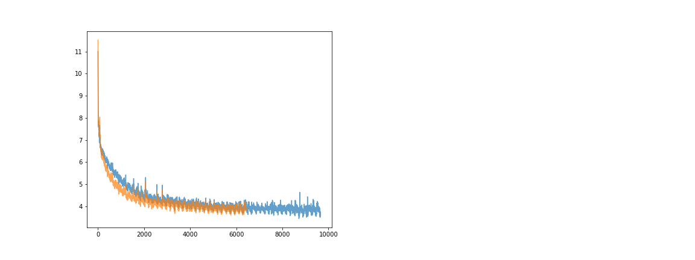
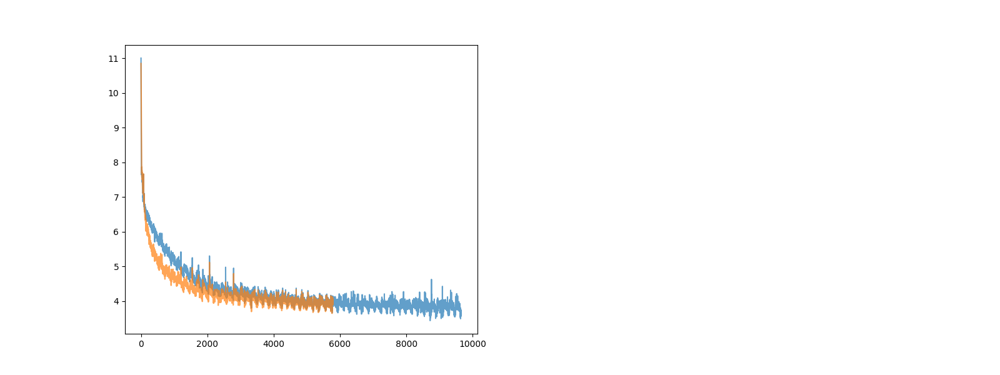
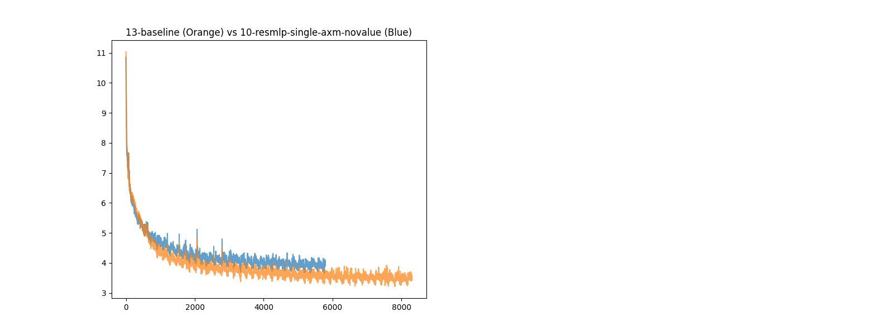
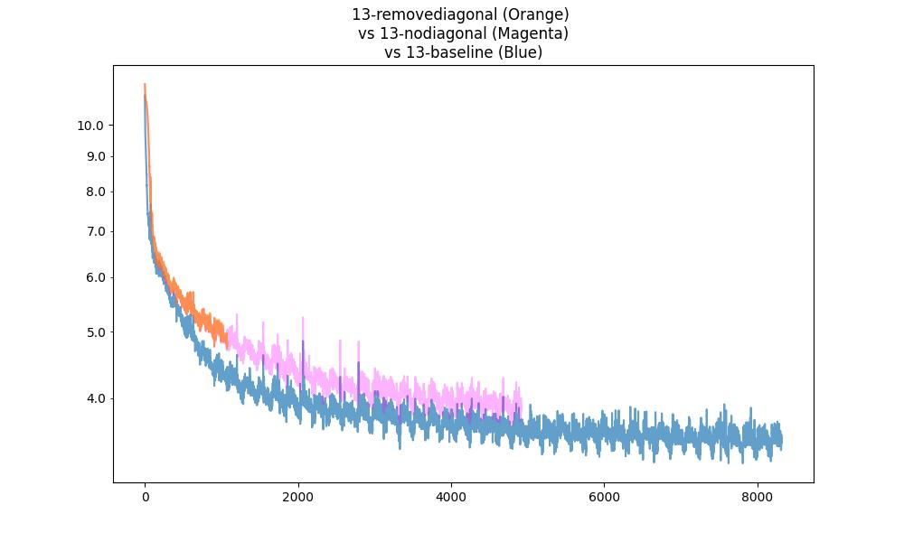
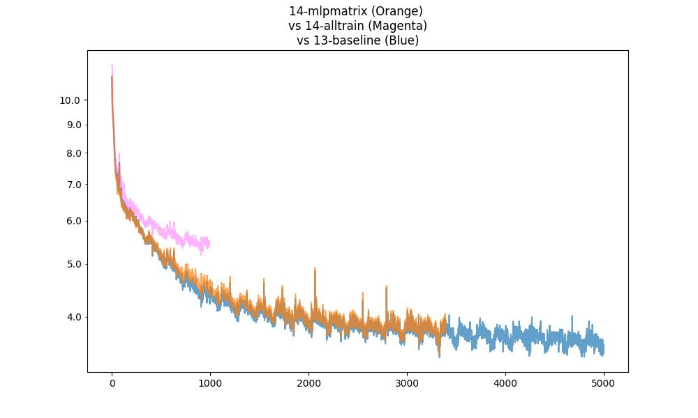
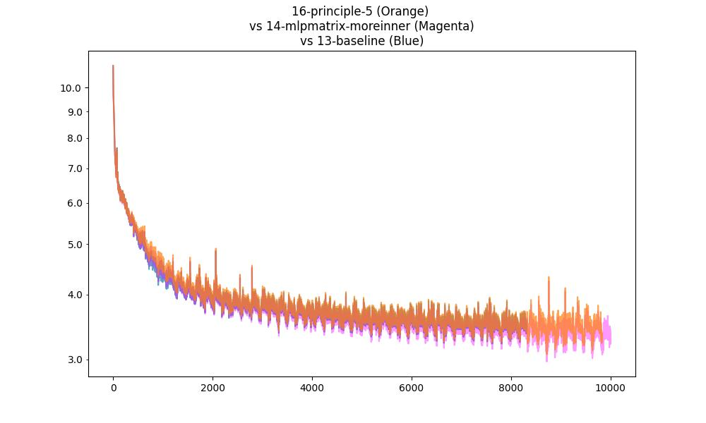
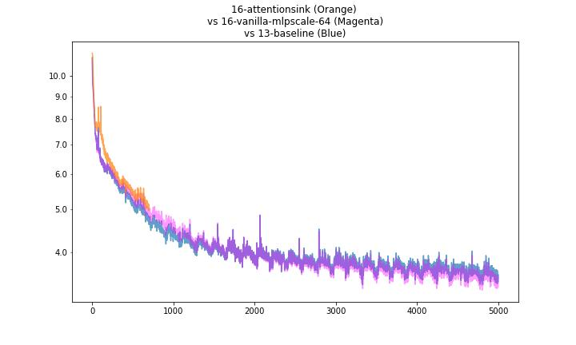

# gpt


```torchrun --standalone --nproc_per_node=1 train_gpt2_ben.py```

```pip freeze -l > requirements.txt```

```source setup.sh```

```screen -dm bash -c 'torchrun --standalone --nproc_per_node=1 train_gpt2.py > log/screen.txt 2>&1'```

```screen -dm bash -c 'torchrun --standalone --nproc_per_node=8 train_gpt2.py > log/screen.txt 2>&1'```

```screen -r```

```screen -dm bash -c 'torchrun --standalone --nproc_per_node=1 train_gpt2_ben.py > screen.txt 2>&1'```

Setup:

`pip3 install --pre torch torchvision torchaudio --index-url https://download.pytorch.org/whl/nightly/cu126`

## Notes

I suspect that additional noise will make training much worse... imagine a cryptographic notion, where I (the student) cannot distinguish between a correct answer and an incorrect answer, then of course, I cannot learn! Or, perhaps it takes many more samples for me to distinguish, then I will need substantially many more samples to learn, and perhaps this is compounded over time (not sure how the compounding works). So really, if we do introduce additional sources of loss, we should ensure that it is not noisy...

Let's say we introduce some RL notion, then it had better not be noisy. A data point should only "count" if it is "highly likely" to be correct. Perhaps we should only make it count if the model itself is highly confident in its assessment, and also penalize confident assessments somehow (or perhaps we don't need to do this, because it is already penalized via the ground truth training data: if it is confidently wrong, then it pushes down the score of the true correct answer, which pushes up the loss).

How do we distinguish between positive and negative assessments? Well, in a conversation, say I say something normal, and you reply with something completely out of left field, or completely wrong. Perhaps, in response, I should be exacerbated, or not know what to say? There is no longer a right answer in response to your "random response" (is there?). So perhaps if I am very confident in my reply, this is strong positive feedback. If I am not very confident in my reply at all, then there is no feedback (as opposed to strong negative feedback) because I don't want to introduce too much noise into the learning mechanism. 

So, `block_loss = -log(1 - pr[max])` (the lower the confidence, the closer the block_loss is to 0; the higher the confidence, the more negative the block_loss (so when added to the loss, the loss gets lower, which is "good").). (Or, do we want a good effect on loss. Negative here is good?) (Shouldn't we want some sort of negative feedback? Negative feedback perhaps only comes from the environment, and not from self learning. But i don't see why that has to be the case...)

Hmm, it still doesn't work very well. I don't see fundamental problems yet. Perhaps one fundamental problem is that the confidence is being pushed very high on early layers, with no bearing on the final layer that outputs. Then, we should maybe sample as soon as the confidence is high enough.


### Notes

##### 1-noise

The issue is that the block_loss was only slightly normalized (i.e. for each layer, -1 * crossentropy / n_layers), but this is still very noisy, so learning is not very good.

##### 2-test

In this one, we set `losses += _block_loss / self.config.n_layer`, where `_block_loss = F.cross_entropy(_logits.view(-1, _logits.size(-1)), _targets.view(-1))` and then `_block_loss = torch.log(1 - torch.exp(-1*_block_loss))`, namely it is positive feedback only. As we can see, it doesn't ever get to good training error, but better than noise.

##### 3-test

Somehow, we want to incentivize high confidence (else e.g. loss accumulates forever? Currently this won't successfuly do this incentivization) whilst penalizing wrong answers. When there is no environmental feedback, the loss should just be the self-confidence (i.e. high if high confidence?). Whenever confidence is high, there is some probability of terminating the line of thought (which is good), yet also a chance of accumulating loss in prior steps. Then model should learn to be confident early.

`loss_ = (xe * _confidence * _mask_BT).mean()`

If targets exist, for now we always multiply them in at every layer (even if it is not sampled). Consider not doing this (todo, is there a theoretical difference?).

##### 4-test

Now, we don't use the true loss against the true target until the network is actually ready to output the target:

```xe_factor = ((xe - 1) * _just_triggered + 1)
loss_ = (xe_factor * _confidence * _mask_BT).mean()
```

This certainly punishes confidence early on.


##### 5-test

Definitely punish confidently wrong answers. But what if there is no target? Ask the next layer if wrong or not wrong. If next layer is very confident, punish (as before), else no change to error. (Is that reasonable?) Fix a bug about asking the next layer for confidence, not the current one (whoops). Or should we reward confidence. (By my simulateability theory, predictable actions are not interesting to me. So if the robot's action was predictable to me, that action is not interesting. But this seems to be different. Note, there is also a distinction between predictability and distinguishability. Also, "did I expect this" from a verifier's point of view, is different from "would I have done the same thing", because note that in self talk, the answer to the latter is always "yes". Maybe heuristically, if I am highly confident, then I did expect it -- I know how to act in return to maximize the true reward; if I am not at all highly confident, then I did not expect the answer at all (it doesn't look like giberish either), and have no clue and no confidence in how to act. Thus, we should reward low confidence, or punish high confidence.)

```xe_factor_prev = ((_xe_prev - 1) * _just_triggered_prev + 1)
loss_ = (xe_factor_prev * _confidence * _mask_BT_prev).mean()
```

What incentivizes higher confidence? Earlier termination thus less loss. Maybe I should really penalize the last layer... Also, adding the additional cross_entropy calculition cost another .5 sec per step.

Result: 


(Strangely linear, but also outputs "the" a hundred times. On further debugging, penalizing confidence appears to cause this behavior. Why?)

##### 6-test

6-test-1: Rerun the "confidence of target" experiment with GPT learning rate.

Note that "0-noearly" is the same as vanilla GPT (but reusing weights) without our early termination mechanism (it is equal to "0-base"? Or does "0-base" have early termination?). "0-original" does not re-use any weights, and needs a smaller learning rate to converge properly. (It's odd that the behavior depends so thoroughly on the learning rate.) "0-gpt-custom" is the same as GPT but with our own code.

Things to try: reduce learning rate for some of the earlier experiments...

Does confidence reinforcement make sense? Recall what each layer does:

-- the attention module: each embedding is the weighted sum of multiple embeddings from the previous layer in its context window, computed according to some "attention matrix".

-- the MLP module is essentially a fact retrieval system; the 4A x A weight matrix + ReLU (or other non-linearity) can be (perhaps) thought of as evaluating a giant |4A|-number set of if statements on A-dimensional embeddings; the A x 4A projection matrix perhaps then "adds" facts to the original embedding (via the residual) depending on which "if statements" passed. (See 3Blue1Brown).

-- backprop "somehow" pushes the attention KVQ matrices, the if statements, and the facts, in the "correct" direction...

Our general hypothesis is that good training data is only one part of learning; acts of "self-reflection" or "self-consistency" are also very important to learning. (Somehow, the model should make two predictions and check whether they are consistent, or be able to evaluate its own quality/consistency indpendently of generating predictions.)

Note that the subsequent logit it generates is indeed such an assessment. Let us reward high confidence / penalize low confidence. (Is it an assessment? An embedding is a high-dimensional representation of a concept, or multiple concepts summed together, i.e. a thought; some may not be directly associated with single words, they may map to multiple words, and so forth... Confidence is just a measure of how they align with a specific english word.)

The problem is that...

A stream of   text that is
  
  of     text that is   next

  of     text that is   next


strangely, the third layer is guessing not the third layer, but continuing to guess the second layer... If i don't feed the residual back in after applying the attention layer, performance is hurt substantially. Why is the residual so important in that case? Is the (previous) embedding itself really a very deep short term memory? Why can't inclusion of the past be learned?

I guess because we add value matrices instead of the embedding itself, the past gets destroyed. (How necessary is the value matrix? Shouldn't the MLP setup deal with that already. Perhaps the value matrices should just be the embedding itself.)

Note that the residual connection and c_proj are extremey important, and I do not know why. The value matrix does not seem so important. (perhaps we can get rid of c_proj?)


A       stream of   text that is
  
stream  of     text that is   next
of      text   that is   next .

Alternatively, we can reward tokens that are equal to the next token in the previous layer.

##### 8-experiments

The probem with `res*attn2(x) + attn(x), x + mlp(LN(x))` seems to be that the residuals are blowing up the more we train it. Same with `res*attn2(x) + attn(x), x * mlp2(LN(x)) + mlp(LN(x))`.  (all layer loss)  We see residuals like

```SIZE COMPARISON prev 2.5294246673583984 next 1.1539545059204102
SIZE COMPARISON prev 2.8568525314331055 next 1.1331876516342163
SIZE COMPARISON prev 2.7836289405822754 next 1.121557354927063
SIZE COMPARISON prev 3.347931385040283 next 1.1270164251327515
SIZE COMPARISON prev 5.639773368835449 next 1.1290345191955566
SIZE COMPARISON prev 15.21493911743164 next 1.1317602396011353
SIZE COMPARISON prev 60.20911407470703 next 1.1316640377044678
SIZE COMPARISON prev 284.3788757324219 next 1.1313221454620361
SIZE COMPARISON prev 1445.6865234375 next 1.1314541101455688
SIZE COMPARISON prev 7582.7626953125 next 1.1323127746582031
SIZE COMPARISON prev 40300.05078125 next 1.133501410484314
SIZE COMPARISON prev 216047.5625 next 1.1349073648452759
```

For something like
`x = x + self.attn(x)  x = x + self.mlp(self.ln_2(x))` (all layer loss) (note, using x instead of res) we see residuals like

```
SIZE COMPARISON prev 18.42753028869629 next 0.8354735374450684
SIZE COMPARISON prev 12.65165901184082 next 0.8403578996658325
SIZE COMPARISON prev 12.434549331665039 next 0.8322869539260864
SIZE COMPARISON prev 13.066632270812988 next 0.8329403400421143
SIZE COMPARISON prev 12.981801986694336 next 0.8330138921737671
SIZE COMPARISON prev 12.918157577514648 next 0.8329639434814453
SIZE COMPARISON prev 12.923635482788086 next 0.8329555988311768
SIZE COMPARISON prev 12.929137229919434 next 0.8329416513442993
SIZE COMPARISON prev 12.931181907653809 next 0.832944393157959
SIZE COMPARISON prev 12.930807113647461 next 0.8329448699951172
SIZE COMPARISON prev 12.930171966552734 next 0.8329458236694336
SIZE COMPARISON prev 12.92995834350586 next 0.832942008972168
```

For vanilla GPT (as usual shared weights), all layer loss, we see by step 1100 (slowly shrinking over more steps)

```
SIZE COMPARISON prev 0.8780975341796875 next 1.1142359972000122
SIZE COMPARISON prev 1.2143694162368774 next 1.110939383506775
SIZE COMPARISON prev 1.652571439743042 next 1.1084067821502686
SIZE COMPARISON prev 2.119270086288452 next 1.1072710752487183
SIZE COMPARISON prev 2.6001691818237305 next 1.1067460775375366
SIZE COMPARISON prev 3.0836727619171143 next 1.1065006256103516
SIZE COMPARISON prev 3.564718246459961 next 1.1063616275787354
SIZE COMPARISON prev 4.042917251586914 next 1.1062694787979126
SIZE COMPARISON prev 4.51833438873291 next 1.1062010526657104
SIZE COMPARISON prev 4.991661548614502 next 1.1061511039733887
SIZE COMPARISON prev 5.463232040405273 next 1.1061171293258667
SIZE COMPARISON prev 5.933814525604248 next 1.1060969829559326
```

and by step 4250:

```SIZE COMPARISON prev 1.5941141843795776 next 1.3911638259887695
SIZE COMPARISON prev 2.485067367553711 next 1.3869950771331787
SIZE COMPARISON prev 3.4810280799865723 next 1.3849396705627441
SIZE COMPARISON prev 4.4364542961120605 next 1.3832675218582153
SIZE COMPARISON prev 5.394400596618652 next 1.3827459812164307
SIZE COMPARISON prev 6.328531265258789 next 1.3822684288024902
SIZE COMPARISON prev 7.25205135345459 next 1.3819595575332642
SIZE COMPARISON prev 8.162321090698242 next 1.381672739982605
SIZE COMPARISON prev 9.063191413879395 next 1.3814265727996826
SIZE COMPARISON prev 9.955363273620605 next 1.3812041282653809
SIZE COMPARISON prev 10.840224266052246 next 1.3810186386108398
SIZE COMPARISON prev 11.719019889831543 next 1.3808491230010986
```

Most of the contribution seems to come from the attention step. In particular e.g. by step 799 for the same experiment as above:

```
SIZE COMPARISON prev 0.9725479483604431 mid 0.05692768841981888 next 1.1076934337615967
SIZE COMPARISON prev 1.208902359008789 mid 1.1301352977752686 next 1.109763503074646
SIZE COMPARISON prev 1.4090938568115234 mid 1.3024053573608398 next 1.111130714416504
SIZE COMPARISON prev 1.5330252647399902 mid 1.396193027496338 next 1.1153910160064697
SIZE COMPARISON prev 1.7066140174865723 mid 1.5469791889190674 next 1.11979341506958
SIZE COMPARISON prev 2.1395297050476074 mid 1.9626308679580688 next 1.1215941905975342
SIZE COMPARISON prev 3.0498666763305664 mid 2.85837459564209 next 1.1217771768569946
SIZE COMPARISON prev 4.754446029663086 mid 4.55536413192749 next 1.1214094161987305
SIZE COMPARISON prev 7.8321757316589355 mid 7.630302429199219 next 1.121267318725586
SIZE COMPARISON prev 13.233830451965332 mid 13.03246784210205 next 1.1213200092315674
SIZE COMPARISON prev 22.627168655395508 mid 22.428388595581055 next 1.1217448711395264
SIZE COMPARISON prev 38.77415466308594 mid 38.57970428466797 next 1.1223392486572266
```

Next, we see if layernorm learnable scale/shift parameters are actualy necessary. Probably not! For res + attn(x), without learnable parameters, by step 499:

```
SIZE COMPARISON prev 1.3563252687454224 mid 0.4865388572216034 next 1.0006482601165771
SIZE COMPARISON prev 1.7924420833587646 mid 1.4573729038238525 next 1.0006499290466309
SIZE COMPARISON prev 2.284381628036499 mid 1.9278755187988281 next 1.0006506443023682
SIZE COMPARISON prev 2.821475028991699 mid 2.4290308952331543 next 1.0006510019302368
SIZE COMPARISON prev 3.3831615447998047 mid 2.9755988121032715 next 1.000651240348816
SIZE COMPARISON prev 3.9586188793182373 mid 3.545346736907959 next 1.0006513595581055
SIZE COMPARISON prev 4.539757251739502 mid 4.125799179077148 next 1.000651478767395
SIZE COMPARISON prev 5.122259140014648 mid 4.709800720214844 next 1.0006515979766846
SIZE COMPARISON prev 5.703899383544922 mid 5.293674945831299 next 1.0006515979766846
SIZE COMPARISON prev 6.283486843109131 mid 5.875919342041016 next 1.0006515979766846
SIZE COMPARISON prev 6.860944747924805 mid 6.455946922302246 next 1.0006515979766846
SIZE COMPARISON prev 7.435906887054443 mid 7.033243179321289 next 1.0006515979766846
```


If we use res*attn(x), weirdly (and as previously seen), the residuals blow up. For LN without learnable parameters (everylayer loss, shared weights), by step 3800:

```
SIZE COMPARISON prev 0.9520694017410278 mid 0.05660898983478546 next 1.0006455183029175
SIZE COMPARISON prev 1.1140660047531128 mid 1.0007506608963013 next 1.0006468296051025
SIZE COMPARISON prev 1.1631948947906494 mid 0.9358635544776917 next 1.000647783279419
SIZE COMPARISON prev 2.937286853790283 mid 2.5033302307128906 next 1.0006508827209473
SIZE COMPARISON prev 23.77895736694336 mid 23.278114318847656 next 1.0006515979766846
SIZE COMPARISON prev 211.52383422851562 mid 211.03501892089844 next 1.0006515979766846
SIZE COMPARISON prev 1932.359130859375 mid 1931.881103515625 next 1.0006515979766846
SIZE COMPARISON prev 17739.107421875 mid 17738.642578125 next 1.0006515979766846
SIZE COMPARISON prev 162568.78125 mid 162568.328125 next 1.0006515979766846
SIZE COMPARISON prev 1477890.75 mid 1477890.25 next 1.0006515979766846
SIZE COMPARISON prev 13287474.0 mid 13287474.0 next 1.0006515979766846
SIZE COMPARISON prev 117777120.0 mid 117777120.0 next 1.0006515979766846
```

Perhaps this means that attn(x) outputs very small numbers, and they are trying to compensate... generally very confusing.


I wonder if res + attn(ln(res)) is at heart performing a "substitutition" into res. And x + mlp(ln(x)) evaluates an if statement and... maybe it should be

```y = res + attn(ln(res))
x = x + mlp(ln(y))
```

and we don't add y back in?

Well, it turns out this sucks, similarly to x = x + attn(x):


What about

```y = res + attn(ln(res))
x = res + mlp(ln(y))
```

well:




(performance seems truly worse) so it is really quite important that the logits directly get the output of the attention layer (instead of solely feeding the attention layer into the mlp and then the output).

Note that for double attention `res*attn2(x) + attn(x), x + mlp(LN(x))`, the residuals still blow up:

```
@ 949 train 5.2751 , allloss: 64.1261, confloss: 0.0000, targetloss: 0.0000, earlystop: 0.000, earlystopdict: [0.0, 0.0, 0.0, 0.0, 0.0, 0.0, 0.0, 0.0, 0.0, 0.0, 0.0, 0.0], lr:5.9999e-04, norm:7.9968, dt: 1769.77ms, tok/sec: 74061.71, flops:30.47, batch-reuse:1
SIZE COMPARISON prev 1.0659868717193604 next 1.0947023630142212
SIZE COMPARISON prev 1.798586368560791 next 1.1034561395645142
SIZE COMPARISON prev 2.1790177822113037 next 1.107276439666748
SIZE COMPARISON prev 2.6335883140563965 next 1.105468511581421
SIZE COMPARISON prev 4.98344612121582 next 1.1039302349090576
SIZE COMPARISON prev 14.011809349060059 next 1.1064351797103882
SIZE COMPARISON prev 56.432098388671875 next 1.106866478919983
SIZE COMPARISON prev 249.68592834472656 next 1.1070586442947388
SIZE COMPARISON prev 1164.308837890625 next 1.1072487831115723
SIZE COMPARISON prev 5611.69482421875 next 1.1074464321136475
SIZE COMPARISON prev 27626.546875 next 1.1076771020889282
SIZE COMPARISON prev 138020.09375 next 1.1078872680664062
```

For `res + attn(x), x * mlp(LN(x))`, it still blows up, but a little slower:

```
@ 949 train 5.3970 , allloss: 65.0632, confloss: 0.0000, targetloss: 0.0000, earlystop: 0.000, earlystopdict: [0.0, 0.0, 0.0, 0.0, 0.0, 0.0, 0.0, 0.0, 0.0, 0.0, 0.0, 0.0], lr:5.9999e-04, norm:8.4142, dt: 1606.70ms, tok/sec: 81578.15, flops:35.93, batch-reuse:1
SIZE COMPARISON prev 0.6984971761703491 mid 0.6713976860046387 next 1.0006380081176758
SIZE COMPARISON prev 0.9332523345947266 mid 0.7942314147949219 next 1.0006457567214966
SIZE COMPARISON prev 1.5732736587524414 mid 1.0734591484069824 next 1.0006494522094727
SIZE COMPARISON prev 2.531172752380371 mid 1.7262670993804932 next 1.0006508827209473
SIZE COMPARISON prev 4.456131935119629 mid 2.7139768600463867 next 1.0006513595581055
SIZE COMPARISON prev 7.704921245574951 mid 4.647169589996338 next 1.0006515979766846
SIZE COMPARISON prev 14.081094741821289 mid 7.897726058959961 next 1.0006515979766846
SIZE COMPARISON prev 25.32900619506836 mid 14.263557434082031 next 1.0006515979766846
SIZE COMPARISON prev 47.37249755859375 mid 25.50238800048828 next 1.0006515979766846
SIZE COMPARISON prev 87.77811431884766 mid 47.53529357910156 next 1.0006515979766846
SIZE COMPARISON prev 166.31536865234375 mid 87.93147277832031 next 1.0006515979766846
SIZE COMPARISON prev 313.864501953125 mid 166.46051025390625 next 1.0006515979766846
...
@ 3499 train 4.1087 , allloss: 50.1864, confloss: 0.0000, targetloss: 0.0000, earlystop: 0.000, earlystopdict: [0.0, 0.0, 0.0, 0.0, 0.0, 0.0, 0.0, 0.0, 0.0, 0.0, 0.0, 0.0], lr:5.9982e-04, norm:7.7492, dt: 1606.40ms, tok/sec: 81593.42, flops:35.93, batch-reuse:1
SIZE COMPARISON prev 0.9271938800811768 mid 0.6703000068664551 next 1.000638723373413
SIZE COMPARISON prev 1.5912479162216187 mid 1.1378358602523804 next 1.000647783279419
SIZE COMPARISON prev 2.6288633346557617 mid 1.8008546829223633 next 1.0006506443023682
SIZE COMPARISON prev 7.2939934730529785 mid 2.786419630050659 next 1.0006515979766846
SIZE COMPARISON prev 53.24920654296875 mid 7.418212890625 next 1.0006517171859741
SIZE COMPARISON prev 499.09014892578125 mid 53.380401611328125 next 1.0006515979766846
SIZE COMPARISON prev 4886.146484375 mid 499.2305908203125 next 1.0006515979766846
SIZE COMPARISON prev 48644.1953125 mid 4886.2861328125 next 1.0006517171859741
SIZE COMPARISON prev 489250.40625 mid 48644.3359375 next 1.0006515979766846
SIZE COMPARISON prev 4965097.5 mid 489250.53125 next 1.0006515979766846
SIZE COMPARISON prev 50753656.0 mid 4965097.5 next 1.0006515979766846
SIZE COMPARISON prev 521954624.0 mid 50753656.0 next 1.0006515979766846
```

What about

```y = res + attn(ln(res))
x = y + mlp(ln(res))
```

i.e. how important is it that the output of attention gets fed into the MLP? It turns out, this works surprisingly well; i.e. attention and MLP both seem to be additive, *independent* components:


```
@ 4099 train 4.1100 , allloss: 50.7263, confloss: 0.0000, targetloss: 0.0000, earlystop: 0.000, earlystopdict: [0.0, 0.0, 0.0, 0.0, 0.0, 0.0, 0.0, 0.0, 0.0, 0.0, 0.0, 0.0], lr:5.9975e-04, norm:4.9580, dt: 1626.09ms, tok/sec: 80605.68, flops:35.50, batch-reuse:1
SIZE COMPARISON prev 1.7276793718338013 mid 0.828337550163269 next 1.0006475448608398
SIZE COMPARISON prev 2.3453421592712402 mid 1.9509013891220093 next 1.0006494522094727
SIZE COMPARISON prev 3.0417964458465576 mid 2.5768418312072754 next 1.0006505250930786
SIZE COMPARISON prev 3.7537474632263184 mid 3.24953031539917 next 1.0006508827209473
SIZE COMPARISON prev 4.469127655029297 mid 3.953681230545044 next 1.0006511211395264
SIZE COMPARISON prev 5.175540447235107 mid 4.6598124504089355 next 1.0006513595581055
SIZE COMPARISON prev 5.872206687927246 mid 5.358777046203613 next 1.0006513595581055
SIZE COMPARISON prev 6.5586748123168945 mid 6.048742294311523 next 1.000651478767395
SIZE COMPARISON prev 7.23720645904541 mid 6.730024337768555 next 1.0006515979766846
SIZE COMPARISON prev 7.907989501953125 mid 7.40459680557251 next 1.0006515979766846
SIZE COMPARISON prev 8.572383880615234 mid 8.07198715209961 next 1.0006515979766846
SIZE COMPARISON prev 9.231319427490234 mid 8.7335205078125 next 1.0006515979766846
```

Note that the above doesn't matter if we change the order of mlp and attn, namely

```y = res + mlp(ln(res))
x = y + attn(ln(res))
```

is equivalent.

What happens if we remove the "all layer loss", and compute loss as per the usual method?


It is in fact, better; the all layer loss is utterly useless.

But note that the std does not blow up as much, weirdly:

```
@ 4399 train 3.7913 , allloss: 3.7913, confloss: 0.0000, targetloss: 0.0000, earlystop: 0.000, earlystopdict: [0.0, 0.0, 0.0, 0.0, 0.0, 0.0, 0.0, 0.0, 0.0, 0.0, 0.0, 0.0], lr:5.9971e-04, norm:0.6440, dt: 411.78ms, tok/sec: 318308.01, flops:140.18, batch-reuse:1
SIZE COMPARISON prev 2.829397439956665 mid 2.238248825073242 next 1.0006511211395264
SIZE COMPARISON prev 2.9154844284057617 mid 2.7668395042419434 next 1.0006510019302368
SIZE COMPARISON prev 2.937965154647827 mid 2.9097206592559814 next 1.0006510019302368
SIZE COMPARISON prev 2.847860336303711 mid 2.835615634918213 next 1.0006510019302368
SIZE COMPARISON prev 2.772952079772949 mid 2.7625179290771484 next 1.0006508827209473
SIZE COMPARISON prev 2.7469887733459473 mid 2.7138304710388184 next 1.0006508827209473
SIZE COMPARISON prev 2.775296211242676 mid 2.707706928253174 next 1.0006508827209473
SIZE COMPARISON prev 2.8555359840393066 mid 2.748220682144165 next 1.0006508827209473
SIZE COMPARISON prev 2.987206220626831 mid 2.838392496109009 next 1.0006510019302368
SIZE COMPARISON prev 3.1633992195129395 mid 2.9731945991516113 next 1.0006511211395264
SIZE COMPARISON prev 3.425197124481201 mid 3.1695663928985596 next 1.000651240348816
SIZE COMPARISON prev 3.9492619037628174 mid 3.533745765686035 next 1.0006513595581055
```

What happens if we 2x the attention component?


```
@ 2449 train 4.2471 , allloss: 4.2471, confloss: 0.0000, targetloss: 0.0000, earlystop: 0.000, earlystopdict: [0.0, 0.0, 0.0, 0.0, 0.0, 0.0, 0.0, 0.0, 0.0, 0.0, 0.0, 0.0], lr:5.9991e-04, norm:0.7454, dt: 411.36ms, tok/sec: 318631.23, flops:140.32, batch-reuse:1
SIZE COMPARISON prev 3.474045753479004 mid 2.998915672302246 next 1.0006513595581055
SIZE COMPARISON prev 3.860865592956543 mid 3.8047633171081543 next 1.0006513595581055
SIZE COMPARISON prev 3.176105499267578 mid 3.17417573928833 next 1.0006511211395264
SIZE COMPARISON prev 2.7696032524108887 mid 2.7842602729797363 next 1.0006510019302368
SIZE COMPARISON prev 2.601201057434082 mid 2.6080410480499268 next 1.0006508827209473
SIZE COMPARISON prev 2.55460524559021 mid 2.5488529205322266 next 1.0006508827209473
SIZE COMPARISON prev 2.535594940185547 mid 2.500566244125366 next 1.0006508827209473
SIZE COMPARISON prev 2.5360474586486816 mid 2.458188056945801 next 1.0006508827209473
SIZE COMPARISON prev 2.598814010620117 mid 2.465818405151367 next 1.0006508827209473
SIZE COMPARISON prev 2.779794216156006 mid 2.578892707824707 next 1.0006510019302368
SIZE COMPARISON prev 3.112057685852051 mid 2.8377723693847656 next 1.0006511211395264
SIZE COMPARISON prev 3.612070083618164 mid 3.259913444519043 next 1.0006513595581055
```

It is worse... why? But it eventually converges, so it doesn't really matter. What if we 0.5x it?


```
@ 1999 train 4.1020 , allloss: 4.1020, confloss: 0.0000, targetloss: 0.0000, earlystop: 0.000, earlystopdict: [0.0, 0.0, 0.0, 0.0, 0.0, 0.0, 0.0, 0.0, 0.0, 0.0, 0.0, 0.0], lr:5.9994e-04, norm:0.6649, dt: 422.70ms, tok/sec: 310084.43, flops:136.56, batch-reuse:1
val: loaded 100000000 tokens (first shard)
val: 1 epoch (1 shard) = 12207 mini-batches
validation loss: 4.2778
SIZE COMPARISON prev 1.7215176820755005 mid 1.1063441038131714 next 1.0006499290466309
SIZE COMPARISON prev 2.114750385284424 mid 1.966301441192627 next 1.0006506443023682
SIZE COMPARISON prev 1.981388807296753 mid 2.1172070503234863 next 1.0006502866744995
SIZE COMPARISON prev 1.8269994258880615 mid 1.9413310289382935 next 1.00065016746521
SIZE COMPARISON prev 1.6911734342575073 mid 1.7758653163909912 next 1.0006499290466309
SIZE COMPARISON prev 1.6034241914749146 mid 1.6564953327178955 next 1.0006498098373413
SIZE COMPARISON prev 1.5692648887634277 mid 1.589362621307373 next 1.0006496906280518
SIZE COMPARISON prev 1.5858174562454224 mid 1.5691030025482178 next 1.0006496906280518
SIZE COMPARISON prev 1.6530719995498657 mid 1.5916287899017334 next 1.0006498098373413
SIZE COMPARISON prev 1.7865718603134155 mid 1.6776154041290283 next 1.0006500482559204
SIZE COMPARISON prev 2.007704973220825 mid 1.845852017402649 next 1.000650405883789
SIZE COMPARISON prev 2.3220303058624268 mid 2.0987911224365234 next 1.0006507635116577
```

It is identical... So it seems that attention is not particularly useful for early gains; it's really the MLP that matters. If we skip out on attention completely:


```
@ 1699 train 5.8143 , allloss: 5.8143, confloss: 0.0000, targetloss: 0.0000, earlystop: 0.000, earlystopdict: [0.0, 0.0, 0.0, 0.0, 0.0, 0.0, 0.0, 0.0, 0.0, 0.0, 0.0, 0.0], lr:5.9996e-04, norm:0.2052, dt: 272.28ms, tok/sec: 481386.85, flops:212.00, batch-reuse:1
SIZE COMPARISON prev 3.032069206237793 mid 0.034484002739191055 next 1.0006475448608398
SIZE COMPARISON prev 4.604878902435303 mid 3.032069206237793 next 1.0006513595581055
SIZE COMPARISON prev 4.4857869148254395 mid 4.604878902435303 next 1.0006513595581055
SIZE COMPARISON prev 4.478532791137695 mid 4.4857869148254395 next 1.0006513595581055
SIZE COMPARISON prev 4.600770473480225 mid 4.478532791137695 next 1.000651478767395
SIZE COMPARISON prev 4.848290920257568 mid 4.600770473480225 next 1.0006513595581055
SIZE COMPARISON prev 5.205094337463379 mid 4.848290920257568 next 1.0006513595581055
SIZE COMPARISON prev 5.654345989227295 mid 5.205094337463379 next 1.0006515979766846
SIZE COMPARISON prev 6.184695720672607 mid 5.654345989227295 next 1.0006513595581055
SIZE COMPARISON prev 6.788667678833008 mid 6.184695720672607 next 1.000651478767395
SIZE COMPARISON prev 7.458611965179443 mid 6.788667678833008 next 1.0006515979766846
SIZE COMPARISON prev 8.18480110168457 mid 7.458611965179443 next 1.0006517171859741
```

It is worse! Whew. Our efforts are validted. But note that the residual still grows... Here, prev is the size of newres, x is the size of ln(prev), and mid is the size of prevres (as opposed to prevres + attn). So MLP is definitely adding a component (perhaps over and over again). 


What happens (for fun) if we do `y = res  + self.attn(x)*self.mlp(x)`:



```
@ 6349 train 3.8610 , allloss: 3.8610, confloss: 0.0000, targetloss: 0.0000, earlystop: 0.000, earlystopdict: [0.0, 0.0, 0.0, 0.0, 0.0, 0.0, 0.0, 0.0, 0.0, 0.0, 0.0, 0.0], lr:5.9941e-04, norm:0.7167, dt: 409.91ms, tok/sec: 319757.28, flops:140.82, batch-reuse:1
SIZE COMPARISON prev 4.092894554138184 mid 4.092894554138184 next 1.0006513595581055
SIZE COMPARISON prev 4.809565544128418 mid 4.809565544128418 next 1.0006513595581055
SIZE COMPARISON prev 4.6843671798706055 mid 4.6843671798706055 next 1.0006513595581055
SIZE COMPARISON prev 4.60699462890625 mid 4.60699462890625 next 1.0006513595581055
SIZE COMPARISON prev 4.567028999328613 mid 4.567028999328613 next 1.0006513595581055
SIZE COMPARISON prev 4.567410945892334 mid 4.567410945892334 next 1.0006513595581055
SIZE COMPARISON prev 4.6050896644592285 mid 4.6050896644592285 next 1.0006513595581055
SIZE COMPARISON prev 4.691596508026123 mid 4.691596508026123 next 1.000651478767395
SIZE COMPARISON prev 4.89960241317749 mid 4.89960241317749 next 1.0006513595581055
SIZE COMPARISON prev 5.414493083953857 mid 5.414493083953857 next 1.0006515979766846
SIZE COMPARISON prev 6.540674686431885 mid 6.540674686431885 next 1.0006515979766846
SIZE COMPARISON prev 8.01706314086914 mid 8.01706314086914 next 1.0006517171859741
rank 0 sample 0: A Poem for you! Roses are red, Potatoes are 
```

It seems to be the best yet.

What happens if we only feed in `attn(x) + mlp(x)` into the attn and mlp components of the next layer, and not the res? (This one crashes).

What happens if we remove the value matrix, and instead just use the identity matrix, and them sum together the output of all of the heads?




```
@ 4699 train 3.9265 , allloss: 3.9265, confloss: 0.0000, targetloss: 0.0000, earlystop: 0.000, earlystopdict: [0.0, 0.0, 0.0, 0.0, 0.0, 0.0, 0.0, 0.0, 0.0, 0.0, 0.0, 0.0], lr:5.9967e-04, norm:0.6336, dt: 1324.04ms, tok/sec: 98993.98, flops:42.88, batch-reuse:1
INFO nextres 33.397308349609375 attn*mlp 33.40809631347656 layernormed 1.0006517171859741
	 attn_hist -29.4375<tensor([ 45., 134., 166., 263., 119.,  41.])>29.25 mlp_hist -10.4375<tensor([ 24., 123., 402., 207.,  10.,   2.], dtype=torch.bfloat16)>15.0625
INFO nextres 193.25694274902344 attn*mlp 195.94659423828125 layernormed 1.0006517171859741
	 attn_hist -75.375<tensor([  1.,  11., 467., 249.,  38.,   2.])>72.75 mlp_hist -58.5<tensor([ 74., 122., 255., 280.,  33.,   5.], dtype=torch.bfloat16)>80.0
INFO nextres 120.01077270507812 attn*mlp 82.8893814086914 layernormed 1.0006517171859741
	 attn_hist -52.5<tensor([ 14., 545., 197.,  10.,   1.,   1.])>116.25 mlp_hist -18.125<tensor([  7.,   3., 272., 278., 190.,  17.], dtype=torch.bfloat16)>6.28125
INFO nextres 71.63121032714844 attn*mlp 55.632476806640625 layernormed 1.0006517171859741
	 attn_hist -45.75<tensor([ 14., 526., 212.,  12.,   2.,   2.])>102.75 mlp_hist -13.0625<tensor([  7.,  24., 362., 226., 137.,  12.], dtype=torch.bfloat16)>5.21875
INFO nextres 44.969993591308594 attn*mlp 30.2081298828125 layernormed 1.0006517171859741
	 attn_hist -49.875<tensor([  8., 436., 308.,  12.,   2.,   2.])>106.5 mlp_hist -7.6875<tensor([ 11., 276., 183., 214.,  74.,  10.], dtype=torch.bfloat16)>3.8125
INFO nextres 29.09838104248047 attn*mlp 18.429052352905273 layernormed 1.0006517171859741
	 attn_hist -45.375<tensor([ 27., 598., 130.,  10.,   1.,   2.])>109.5 mlp_hist -4.8125<tensor([155., 192., 158., 181.,  71.,  11.], dtype=torch.bfloat16)>2.78125
INFO nextres 19.71997833251953 attn*mlp 12.138340950012207 layernormed 1.0006517171859741
	 attn_hist -35.8125<tensor([132., 586.,  42.,   6.,   1.,   1.])>112.5 mlp_hist -3.65625<tensor([210., 152., 167., 177.,  56.,   6.], dtype=torch.bfloat16)>2.609375
INFO nextres 15.027619361877441 attn*mlp 7.450224876403809 layernormed 1.0006517171859741
	 attn_hist -34.5<tensor([121., 542.,  94.,   9.,   1.,   1.])>99.0 mlp_hist -3.25<tensor([166., 180., 143., 212.,  57.,  10.], dtype=torch.bfloat16)>2.09375
INFO nextres 13.641393661499023 attn*mlp 5.161359786987305 layernormed 1.0006517171859741
	 attn_hist -36.75<tensor([ 47., 202., 477.,  38.,   2.,   2.])>73.875 mlp_hist -3.1875<tensor([ 13., 253., 178., 238.,  70.,  16.], dtype=torch.bfloat16)>1.609375
INFO nextres 15.402214050292969 attn*mlp 6.81701135635376 layernormed 1.0006517171859741
	 attn_hist -36.5625<tensor([ 28., 136., 418., 123.,  58.,   5.])>44.25 mlp_hist -4.125<tensor([  4.,  26.,  81., 354., 270.,  33.], dtype=torch.bfloat16)>1.5703125
INFO nextres 19.019399642944336 attn*mlp 8.641536712646484 layernormed 1.0006517171859741
	 attn_hist -30.0<tensor([ 65., 130., 418.,  95.,  55.,   5.])>43.5 mlp_hist -5.03125<tensor([ 24., 156., 308.,  90., 113.,  78.], dtype=torch.bfloat16)>5.65625
INFO nextres 20.741458892822266 attn*mlp 7.100666046142578 layernormed 1.0006517171859741
	 attn_hist -34.3125<tensor([ 21., 186., 411., 108.,  38.,   4.])>50.625 mlp_hist -5.34375<tensor([ 23., 328., 159.,  73.,  66., 120.], dtype=torch.bfloat16)>8.1875
```

It is almost as good, but definitely not as good (I wonder if because we got rid of that one projection matrix).


Recall that in combinator calculuses, we need to be able to (1) copy arguments (inverting this operation is kind of the point of compression / learning a computation) and (2) apply arguments to each other (programmability). When inverting, I suspect it is just pattern match replacement (is this the MLP). Magnitude is somehow important for the encoding. Attention combines tokens into single embeddings? Is this some manifestation of programmability. Or, is everything truly in the forward direction. Attention takes a weighted sum of prior tokens.

Somehow, addition feels like an application / one-step evaluation / perhaps it refers to the depth of the tree, and each embedding dimension is like a possible subtree at each level. Or does attention give tree structure.

Somehow, a sequence of embeddings represents code. The attention component learns how individual tokens (read subtrees) programmatically act on other tokens (other subtrees). (But what is this value matrix?) Note that addition does not distinguish between left and right subtrees, or have an order, so how do we deal with it...  


General framework:
- Backprop performs memorization of substitution rules.
- regularization through LN limits "how much" we can memorize (limiting standard deviation).
- forward pass performs the actual computation.

Try again:
- the embedding itself encodes things like its position in the tree... and also its subtree... which is itself a sum of embeddings... (how is this possible? We only give it a 1D positional embedding.)
- The MLP maps nodes (i.e. subtrees) to compressed inverses.
- Attention then joins more nodes together as appropriate. (Why not join all nodes together? Well, maybe MLP cannot distinguish such a big sum? It shouldn't actually matter..., MLP should be able to distinguish. So why?) (If we sum everything together at every T, then the MLP triggers for every location T.) So somehow, we want the MLP to trigger selectively and in the right order.

But how come the MLP can't pick out specific patterns by itself? Why does it need the attention... what does element-wise multiplication mean, between two embeddings? A masked embedding? Attention is the mask (does it generate only boolean outputs)? MLP is the mask? why do we need to mask  the output of the mlp? What does magnitude of embedding mean?

An embedding does not see its sibling trees. Attention computes (given the embeddings) which  other nodes each on acts on / is connected to, outputting a parent node (the sum of the child nodes). The MLP layer takes as input an embedding (subtree) and inverts it (ideally to something more compressed). But the result is added on. Why is it added on? It should instead replace the embedding (but maybe not the whole thing, of only a subtree was inverted?)


Question:

what happens if i backprop every layer, but only propagate the gradient one layer

termination when it no longer updates / when it converges


## On Backprop

Note that the all_layer generally does seem slightly worse. For instance:

```testname = "10-resmlp-single-axm-novalue-copy-alllayer"
basename = "10-resmlp-single-axm-novalue"
```


With all-layer loss, the mlp size does seem smaller, and the graphs seemed more centered.

Let us now try it without deep propagation, i.e. all layer but only propagating the gradient one step:


## RMSNorm

Now, going bak to single layer loss, using the axm architecture, what does it look like with RMSNorm?


## On MLP

One hypothesis is that the MLP performs a copy of the embedding in a memorized location, i.e. it rotates it, or adds a positional embedding (and maybe this is why the residual is important?)

Try MLP(x+LN(y))

Position embeddings are definitely additive. If we switch from `x = tok_emb + pos_emb` to `x = tok_emb * pos_emb`, the capability of the model to compute is completely destroyed:


If we do `y = self.attn(x), z=self.mlp(x*y)*y`, the capability is slightly weakened, but not fully destroyed (it probably also converges?)


Adjusting the input again, `y = self.attn(x), z=self.mlp(x+y)*y`


So really, we want to feed in just x into the mlp. (Why?)

Now, let's see what happens if we don't feed in the residual to future layers, but we do add the positional embedding back in at every layer:


Nope! The residual is clearly important for reasons other than the initial positional embedding.

What if we do

```
attn = self.attn(y, y)
mlp = self.mlp(x)
y = attn*mlp
x = res + y
newres = x
x = self.ln(x)
```

This crashes because values quickly go to infinity or zero.


What if we do: `y = KQ(x) @ mlp(x)` instead? Well, it turns out worse. So somehow the fact that we are doing a linear combination of `x` and not `mlp(x)` is important. But note, mlp is not introduced anywhere else! (We took it away from the `attn*mlp` term.) And it still does seem to be able to learn. I.e.
```
mlp = self.mlp(x)
attn = self.attn(x, mlp)
y = attn
x = res + y
newres = x
x = self.ln(x)
```


What if we do `y = KQ(mlp(x)) @ x`. Then, as before, it performs worse, but it is not fatal:
```
mlp = self.mlp(x)
attn = self.attn(mlp, x)
y = attn
x = res + y
newres = x
x = self.ln(x)
```


Out of curiosity, what if we get rid of mlp entirely. It turns out both of the above experiments look exactly like this one! So certainly the non-linearity is essential, but it does not show up immediately.
```
attn = self.attn(x, x)
y = attn
x = res + y
newres = x
x = self.ln(x)
```


What if run attn on mlp only; this is much worse than nomlp, and also much worse than self.attn(mlp,x). Of all of these experiments (without including the mlp component elsewhere), `self.attn(mlp, x)` is for some reason the best (and `self.attn(mlp, mlp)` is the worst).
```
mlp = self.mlp(x)
attn = self.attn(mlp, mlp)
y = attn
x = res + y
newres = x
x = RMSNorm(x, ELEMENTWISEAFFINE={ELEMENTWISEAFFINE}), 
```


Does it matter at all what I feed into attn?
```
mlp = self.mlp(x)
attn = self.attn(mlp, x)
y = attn*mlp
x = res + y
newres = x
x = RMSNorm(x, ELEMENTWISEAFFINE={ELEMENTWISEAFFINE}), 
```


Directly comparing the previous to the vanilla experiment... (orange is attn(x, x))
```
mlp = self.mlp(x)
attn = self.attn(x, x)
y = attn*mlp
x = res + y
newres = x
x = RMSNorm(x, ELEMENTWISEAFFINE={ELEMENTWISEAFFINE}), 
```


so, yeah. I'm stumped. The best still seems to be `x = LN(res + attn(x)*mlp(x))`. For good measure, let's try feeding only attn into the mlp input: (This one should be very bad if I remember correctly)
```
attn = self.attn(x, x)
mlp = self.mlp(attn)
y = attn*mlp
x = res + y
newres = x
x = RMSNorm(x, ELEMENTWISEAFFINE={ELEMENTWISEAFFINE}), 
```


Oh hey. it's surprisingly not so bad, but it is definitely worse. When was it bad? Perhaps when it was `attn + mlp`. Let's try:
```
attn = self.attn(x, x)
mlp = self.mlp(attn)
y = attn+mlp
x = res + y
newres = x
x = RMSNorm(x, ELEMENTWISEAFFINE={ELEMENTWISEAFFINE}), 
```


For good measure, let's run the vanilla GPT with RMSNorm and no value matrix:
```
attn = self.attn(x, x)
mlp = self.mlp(x)
y = attn+mlp
x = res + y
newres = x
x = RMSNorm(x, ELEMENTWISEAFFINE={ELEMENTWISEAFFINE}), 
```


In general, it seems important to feed the whole `x` into the mlp and attention layers. In some sense, `x` represents an entire embedding, whereas attn and mlp perhaps generate only part of it. 

Now, one last time, why is the residual so important? What happens again if I do this:
```
attn = self.attn(x, x)
mlp = self.mlp(x)
y = attn*mlp
x = y
newres = x
x = RMSNorm(x, ELEMENTWISEAFFINE={ELEMENTWISEAFFINE}), 
```


It doesn't work particularly well, but what happens if I turn All Layer Loss back on?


So surprisingly, removing the residual is fine if we do `attn*mlp`, as long as we have all layer loss. It does seem to converge a little slower. If we do `attn + mlp`, what happens?

(todo)


I do think that from first principles, it should be as follows (with the residual, because the mlp is allowed to be a `no-op'.). But, concretely, this doesn't work as well for some reason (maybe it converges over time?):
```
attn = self.attn(x, x)
mlp = self.mlp(attn)
y = mlp
x = y + res
newres = x
x = RMSNorm(x, ELEMENTWISEAFFINE={ELEMENTWISEAFFINE}), 
```


Or, maybe even `y*res`? Nope, the loss here is stuck and doesn't change, so there is some numerical problem.
```
attn = self.attn(x, x)
mlp = self.mlp(attn)
y = mlp
x = y * res
newres = x
x = RMSNorm(x, ELEMENTWISEAFFINE={ELEMENTWISEAFFINE}), 
```


Let's try this one again but train it longer. IT does eventually converge to the same place, I think!
```
attn = self.attn(x, x)
mlp = self.mlp(attn)
y = mlp
x = y + res
newres = x
x = RMSNorm(x, ELEMENTWISEAFFINE={ELEMENTWISEAFFINE}), 
```


Generally, we need a way for mlp to express a `no-op`. Also, one question is why taking the attention out actually makes it train faster.

# Bringing the forward pass together

One question is, how come we don't just sum together the entire context window? Well, the thing is that some tokens attend to other tokens selectively, and not others. So it could be that `[A B]` does something, but `[C B]` does not, and we should really only sum tokens together when we know it (potentially) does something. (Or, does attention compute instead whether `A` and `B` are positioned together / near each other?) (In that case, this whole key query interpretation is kind of ridiculous, and can maybe be replaced by inverses of the position embedding.)

So, continuing this line of thought, if attention computes whether two tokens are positioned adjacent to each other (whcih would be a function of their *positions* only and not necessarily their semantic content, unless the two are conflated, which they may well be in natural language), then mlp should compute its *replacement*, namely, if `C = [A B]`, then MLP should learn `C`. This has the property that it describes both the inverse computation and the forward computation; i.e. if we are trying to compress the output of some computation, I think that this compression map can be learned exactly by learning `C` (i.e. learning some language for the forward computation). [Not going to lie, this is somewhat trippy.] 

Importantly, it could also be that `[A B]` is a no-op, that is, it is already in its most simplified form, and so `[A B] = [A B]`. It could also be that `[A B C D E] = [A B' C D E]` is mostly a no-op, but there is some small operation. But, it seems that `[A B]` should fully replace the separate `A` and `B` from the previous layer (i.e. applying positional properties should not result in a no-op). The no-op could be implemented using a gate much like in an LSTM. Alternatively, a simple addition may be enough (not sure how to do a full replacement). So, I think, from these vague "principles", I expect the following architecture to be ideal (in terms of expressiveness, and interpretability, but not sure about optimizability):

```
x = self.attn(x, x) + x # (is this +x necessary? Or +res? Or nothing?)
midx = x
mlp = self.mlp(x)
gate = sigmoid(self.mlp2(x))
x = x*gate + mlp
newres = x
x = RMSNorm(x, ELEMENTWISEAFFINE={ELEMENTWISEAFFINE}), 
```

The RMSNorm may not even be necessary. Is this additional mlp necessary, or can it just be learned via the embedding matrix? Is the residual previously necessary, only to allow for the implementation of no-op? (Previously, the norm of attn(x) is 10x that of mlp(x), but 1/4 of that of res.)

## Experiments

First, we try, without all layer loss. Note that it is exceptionally important to normalize the input to the MLP, else the gradient quickly approaches NaN. During optimization, it is also important that the MLP get a piece of the real residual signal, without it being fully destroyed by attention (why?), or alternatively we use all layer loss.
```
attn = self.attn(x, x) + x
y = self.ln(attn)
mlp = self.mlp(y)
midx = mlp
y = torch.sigmoid(self.mlp2(mlp))
x = mlp + res*(1 - y)
newres = x
x = self.ln(x)
```

Frankly, it's not clear how well the previous worked... but the curve is interesting, it certainly converges.


Let's test vanilla architectural changes. Consider transformers as conditional summation. The hypothesis is that this should perform just as well as our usual `mlp*attn` achitecture:
```
class Gate(DualModule):

    def __init__(self, config):
        super().__init__()
        self.c_fc = nn.Linear(config.n_embd, 4 * config.n_embd)
        # smoother ReLU, also maybe helps dead neurons empirically?
        # (should just delete dead neurons)
        self.gelu = nn.GELU(approximate='tanh')  # should just use 'none' if not trying to copy GPT2
    
    def forward(self, x):
        x = self.c_fc(x)
        x = self.gelu(x)
        x = x.sum(dim=-1, keepdim=True) # sum over the last dimension
        x = torch.sigmoid(x)
        return x
```
```
attn = self.attn(x, x)
mlp = self.gate(x)
midx = mlp
y = mlp*attn
x = y + res
newres = x
x = self.ln(x)
```


But unfortunately, it doesn't! In fact, the curve looks less nice than the prior experiment, and I'm not even sure that it converges. So we really lose a lot of expressitivity; the hypothesis is just wrong. To verify that it isn't some issue with some other part of the code, let's just run the original `mlp*attn` architecture again. It seems fine, no issues:
```
attn = self.attn(x, x)
mlp = self.mlp(x)
midx = mlp
y = mlp*attn
x = y + res
newres = x
x = self.ln(x)
```


I wonder how much of the gate experiment is just loss in parameters, i.e. if we add in the same number of parameters and then do a summation, does it help?  It turns out ot make no difference at all, compared to the `12-gate-axg` experiment.
```
class Gate(DualModule):

    def __init__(self, config):
        super().__init__()
        self.c_fc = nn.Linear(config.n_embd, 4 * config.n_embd)
        # smoother ReLU, also maybe helps dead neurons empirically?
        # (should just delete dead neurons)
        self.gelu = nn.GELU(approximate='tanh')  # should just use 'none' if not trying to copy GPT2
        self.c_proj = nn.Linear(4 * config.n_embd, config.n_embd)
    
    def forward(self, x):
        x = self.c_fc(x)
        x = self.gelu(x)
        x = self.c_proj(x)
        x = x.sum(dim=-1, keepdim=True) # sum over the last dimension
        x = torch.sigmoid(x)
        return x
```
```
attn = self.attn(x, x)
mlp = self.gate(x)
midx = mlp
y = mlp*attn
x = y + res
newres = x
x = self.ln(x)
```


This points to the conclusion that the mlp does not just serve as a gate; it is in fact memorizing useful information. This begs the question: is attention itself serving as a gate? No, it seems that the attention component is not just functioning as a gate. (The outcome reminds me of the outcome of removing attention entirely.)
```
attn = self.attn(x, x)
mlp = self.mlp(x)
midx = mlp
gate = attn.sum(dim=-1, keepdim=True)
y = mlp*gate
x = y + res
newres = x
x = self.ln(x)
```


Let me also feed in the gate through a sigmoid to make sure we are coming to the correct conclusion. The conclusion remains unchanged:
```
attn = self.attn(x, x)
mlp = self.mlp(x)
midx = mlp
gate = torch.sigmoid(attn.sum(dim=-1, keepdim=True))
y = mlp*gate
x = y + res
newres = x
x = self.ln(x)
```


Let's keep trying random things. First, let's try adding attn back into the residual, in hopes that it makes optimization faster (it does not make optimization faster):
```
attn = self.attn(x, x)
mlp = self.mlp(x)
midx = mlp
y = mlp*attn
x = y + attn + res
newres = x
x = self.ln(x)
```


Is this really the best version of this architecture? Let's check if giving mlp access to attn helps with anything... No, it in fact penalizes things. (wtf) Probably the more pure the residual signal, the better at first...
```
attn = self.attn(x, x)
mlp = self.mlp(x + attn)
midx = mlp
y = mlp*attn
x = y + res
newres = x
x = self.ln(x)
```


Let's check if giving mlp only access to attn hurts anything... (It hurts things a little bit)
```
attn = self.attn(x, x)
mlp = self.mlp(attn)
midx = mlp
y = mlp*attn
x = y + res
newres = x
x = self.ln(x)
```


TODO: original transformer basline:
```
attn = self.attn(x, x)
mlp = self.mlp(self.ln(attn + res))
midx = mlp
y = mlp
x = y + attn + res
newres = x
x = self.ln(x)
```


Let's train a larger model just for fun (value matrix is set to True)
```
attn = self.attn(x, x)
mlp = self.mlp(x)
midx = mlp
y = mlp*attn
x = y + res
newres = x
x = self.ln(x)
```


TODO train a baseline GPT-medium (copy Kaparthy code)


Let's "rotate" the mlp before applying it (this is probably redundant, because the last layer of the MLP probably already does this). It doesn't seem to work super well, but it does converge (does it get better?) (value matrix is set to True)
```
attn = self.attn(x, x)
mlp = self.rotator(self.mlp(x))
midx = mlp
y = mlp*attn
x = y + res
newres = x
x = self.ln(x)
```


Let's try the rotator again but with more warmup time (from `100` from `10`). It still doesn't seem to bring any improvement. (value matrix is set to True)
```
attn = self.attn(x, x)
mlp = self.rotator(self.mlp(x))
midx = mlp
y = mlp*attn
x = y + res
newres = x
x = self.ln(x)
```


Let's set `n_embd = 1296` (and also increase warmupsteps to `100` from `10`). More embed is not substantially better! (TODO try normal transformers, is it substantially better there?) (value matrix is set to True)
```
attn = self.attn(x, x)
mlp = self.mlp(x)
midx = mlp
y = mlp*attn
x = y + res
newres = x
x = self.ln(x)
```


Let's go back to `n_embd = 768` (and also increase warmupsteps to `100` from `10`). Optimization is a little slower but it ends up in the same place. (value matrix is set to True)
```
attn = self.attn(x, x)
mlp = self.mlp(x)
midx = mlp
y = mlp*attn
x = y + res
newres = x
x = self.ln(x)
```


Let me try to reproduce axm again... wait, why is it different? (value matrix is set to True) (Warmup steps `10`).
```
attn = self.attn(x, x)
mlp = self.mlp(x)
midx = mlp
y = mlp*attn
x = y + res
newres = x
x = self.ln(x)
```


Maybe I have to turn off the value matrix... Indeed it was because of the value matrix. (Warmup steps `10`). Yes this is closer (discrepancy may be due to RMSNorm, I forget now.)
```
attn = self.attn(x, x)
mlp = self.mlp(x)
midx = mlp
y = mlp*attn
x = y + res
newres = x
x = self.ln(x)
```


Let's send warmup steps back to `100` and turn the value matrix back on just for faster training.  What happens if we use x instead of res? It is simply a lost cause, optimization-wise, even with learning rate set to 1/4 of the usual (`1.5e-4` instaed of `6e-4`.) (It may eventually converge to the same place, I think, eventually? But I don't have enough patience to find out.) **TODO: why is this harder to optimize?**
```
attn = self.attn(x, x)
mlp = self.mlp(x)
midx = mlp
y = mlp*attn
x = y + x
newres = x
x = self.ln(x)
```


I suspect that the mlp is deleting "semantic dimensions" of note (but this only works if dimensions align...). Does the size of mlp output scale with the size of the residual that we are trying to attenuate? What if we try to help it along, directly have it attenuate res (hopefully), and add attn separately? There appears to be no tangible benefit.
```
attn = self.attn(x, x)
mlp = self.mlp(x)
midx = mlp
y = mlp*res
x = y + res + attn
newres = x
x = self.ln(x)
```


Let's revisit vanilla attention, with indpenednet blocks, copying a bit from the original Kaprthy code. Wait, it does much better! Why?
```
x = x + self.attn(self.ln_1(x))
x = x + self.mlp(self.ln_2(x))
```



Let's make sure that our multiplication schematic is still competitive when not reusing weights. Vanilla is still true. Unlike previously, this seems to be a complete no-op. (Maybe this only helps in the re-using weight regime?)
```
y = self.ln_1(x)
x = x + self.attn(y)*self.mlp(y)
```


Let's turn on the original, reusing weights.
```
x = x + self.attn(self.ln_1(x))
x = x + self.mlp(self.ln_2(x))
======== 
VALUEMATRIX=True
REUSE_WEIGHTS=True
MLP_SCALE=4
```


Clearly reusing weight is what is wrong. So it seems like we need to probably increase the size of the mlp matrix correspondingly (from 4 to something larger, i.e. 4*NUMLAYERS to match the original number of weights) if we do decide to reuse weights.

Let's turn on multiplication re-using wieghts again, just to see if munltiplication helps in the re-using weights regime. (Yes, it does improve optimization a little bit) Note that removing the value matrix in fact also improves things substantially during optimization (but is slower):
```
y = self.ln_1(x)
x = x + self.attn(y)*self.mlp(y)
======== 
VALUEMATRIX=True
REUSE_WEIGHTS=True
MLP_SCALE=4
```


Now, setting MLP_SCALE=4*12=48, to match the weights lost due to removal. Our hypothesis is wrong, and increasing the size of the MLP doesn't really help! 
```
y = self.ln_1(x)
x = x + self.attn(y)*self.mlp(y)
======== 
VALUEMATRIX=True
REUSE_WEIGHTS=True
MLP_SCALE=48
```


To make sure, let's try `MLP_SCALE=48` for addition too. The performance impact of not reusing weights persists:
```
x = x + self.attn(self.ln_1(x))
x = x + self.mlp(self.ln_2(x))
======== 
VALUEMATRIX=True
REUSE_WEIGHTS=True
MLP_SCALE=48
```


So somehow, it seems that we want to learn a different MLP for each layer. TODO


Returning to the non-reusing-weights regime, what happens if we specifically have mlp negate embeddings that contribute to attention. This performs decidely worse:
```
y = self.ln_1(x)
mlp=self.mlp(y)
x = x + self.attn(y,mlp*y)
======== 
VALUEMATRIX=False
REUSE_WEIGHTS=False
MLP_SCALE=4
```


I don't understand though; isn't that mathematically equivalent to (note that this experiment, the no-value no-sharing-weights, is the best yet):
```
y = self.ln_1(x)
mlp=self.mlp(y)
x = x + self.attn(y,y)*mlp
======== 
VALUEMATRIX=False
REUSE_WEIGHTS=False
MLP_SCALE=4
```


No, they are not equivalent; the difference is that mlp also has dimension `(B, T, C)`. And when we do element-wise multiplication, in the first experiment `attn(y, mlp*y)`, each contribution is multiplied by the source token MLP weight, whereas when we do `attn(y, y)*mlp`, the final output is weighted by the destination token MLP.

Now let's try: (TODO try putting second LN bak in and running attn on output of mlp). ONe hypothesis is that MLP exists exclusively to ``negate'' certain priveleged dimensions of the residual, and maybe htis architecture would facilitate that. But clearly, it does not facilitate it, it seems to be a long-term penalty:
```
y = self.ln_1(x)
mlp=self.mlp(y)
x = x + mlp*x + self.attn(y,y)
======== 
VALUEMATRIX=False
REUSE_WEIGHTS=False
MLP_SCALE=4
```


Orthogonally, I would like to get of the residual. Ideally, `attn(x)` can learn to replace it, but the problem is that it runs itself through a softmax, so the weight of the identity will always decrease. We need to allow the weight of the original to stay the same (i.e. in computation, we need to allow union in addition to replacement, and replacement is handled by the MLP). Can we avoid running the attn through softmax? (This doesn't work)
```
y = self.ln_1(x)
mlp=self.mlp(y)
x = 2*self.attn(y,y)*mlp
======== 
VALUEMATRIX=False
REUSE_WEIGHTS=False
MLP_SCALE=4
```


Let's try running attention through a sigmoid instead (It deosn't work)
```
y = self.ln_1(x)
mlp=self.mlp(y)
x = self.sigmoidattn(y,y)*mlp
======== 
VALUEMATRIX=False
REUSE_WEIGHTS=False
MLP_SCALE=4
```


Adding x back: it seems anyways extremely important, that self.attn always picks "the best ones to combine" (maybe to prevent too much information pollution). Otherwise, there seems not to be any incentive not to send every weight to be equal to 1: (TODO what if we set every weight to be 1)
```
y = self.ln_1(x)
mlp=self.mlp(y)
x = self.sigmoidattn(y,y)*mlp+x
======== 
VALUEMATRIX=False
REUSE_WEIGHTS=False
MLP_SCALE=4
```


Just for fun, just force the attention diagonal to always be 1 (keeping sigmoid):
```
y = self.ln_1(x)
mlp=self.mlp(y)
x = self.sigmoiddiagattn(y,y)*mlp+x
======== 
VALUEMATRIX=False
REUSE_WEIGHTS=False
MLP_SCALE=4
```


Removing the `+x`:
```
y = self.ln_1(x)
mlp=self.mlp(y)
x = self.sigmoiddiagattn(y,y)*mlp
======== 
VALUEMATRIX=False
REUSE_WEIGHTS=False
MLP_SCALE=4
```


Alright now, switching gears entirely back to something more complicated. This is my best blind guess at an architecture currently. The outcome is that it converges to the same place but is decidely slower to optimize in the very beginning:
```
y = self.ln_1(x)
newemb = self.attn(y) + x
mlp=self.mlp(self.ln_2(newemb))
x = mlp*newemb + x
========
VALUEMATRIX=True
REUSE_WEIGHTS=False
MLP_SCALE=4
```


Does delaying the input of mlp by a layer change anything at all? It optimizes faster, but then seems to fail and get worse later, even decongealing after step 4000. So input delay to MLP doesn't matter and maybe it in fact hurts, but maybe ensuring there is a large residual component to multiply into mlp helps with optimization early on but maybe not later? (So mlp maybe isn't attenuating x? I'm thoroughly confused.)
```
y = self.ln_1(x)
newemb = self.attn(y) + x
mlp=self.mlp(y)
x = mlp*newemb + x
========
VALUEMATRIX=True
REUSE_WEIGHTS=False
MLP_SCALE=4
```


Another experiment. Note that here, I forgot to pass the residual into mlp. It doesn't realy converge to the same spot...
```
y = self.ln_1(x)
newemb = self.attn(y)
mlp=self.mlp(self.ln_2(newemb))
x = mlp*newemb + x
========
VALUEMATRIX=True
REUSE_WEIGHTS=False
MLP_SCALE=4
```


Let's feed the residual back in. Compared to the first "complicated" experiment, here mlp only multiplies `self.attn(y)`, and not `x`; it is worse than the first complicated experiment. Compared to the `axm` experiments, here mlp additionally gets an un-attenuated attn component as input, which is clearly a penalty. So for some reason, it is is important to explicitly attenuate only the attention component, and not the residual.
```
y = self.ln_1(x)
newemb = self.attn(y)
mlp=self.mlp(self.ln_2(newemb + x))
x = mlp*newemb + x
========
VALUEMATRIX=True
REUSE_WEIGHTS=False
MLP_SCALE=4
```


Experiment 5:
```
y = self.ln_1(x)
newemb = self.attn(y)
mlp=self.mlp(self.ln_2(newemb))
x = mlp*(newemb + x) + x
========
VALUEMATRIX=True
REUSE_WEIGHTS=False
MLP_SCALE=4
```


Experiment 6:
```
y = self.ln_1(x)
newemb = self.attn(y)
mlp=self.mlp(self.ln_2(newemb))
x = mlp*(x) + x
========
VALUEMATRIX=True
REUSE_WEIGHTS=False
MLP_SCALE=4
```


The takeaways: (Experiment 2) `mlp(x) * (self.attn(x) + x)` seems to optimize faster than (Experiment 1) `mlp(self.attn(x)+x) * (self.attn(x) + x)` at first, but later it really fails. (Experiment 3) `mlp(self.attn(x)) * (self.attn(x))` only is atrocious, worse than both. (Experiment 4) `mlp(self.attn(x)+x) * (self.attn(x))` is overall just slightly worse than Experiment 1, thouguh has a tiny optimization bump in the very beginning... (Experiment 5) `mlp(self.attn(x)) * (self.attn(x) + x)` optimizes slowly at the beginning, and doesn't look like it will converge to a good place (TODO run for longer)... (Experiment 6) `mlp(self.attn(x)) * (x)` is more stable than 5 but is even worse worse than Experiment 3. All are worse than (13-baseline-axm)  `mlp(x) * self.attn(x)`.

Takeaways: MLP needs to see the residual, not just attention. It doesn't care about the current attention component at all. It also shouldn't multiply the residual itself (and it should multiply attention only) -- it converges faster but really odd things happen later down the road...


## More Semantics


Let's remove the 1s from the diagonal of attention. The motivation here is, we are already copying x, there is no need to copy it again (but wait, what if there is no application to do, i.e. it is not near anything. I suspect this will not do as well. Instead, we should do the next experiment.) (I accidentally deleted this run...)
```
self.register_buffer("mask", torch.tril(torch.ones(config.block_size, config.block_size),diagonal=-1).bool().view(1, 1, config.block_size, config.block_size))
========
y = self.ln_1(x)
attn = self.attn(y)
mlp=self.mlp(y)
x = mlp*attn + x
========
VALUEMATRIX=True
REUSE_WEIGHTS=False
MLP_SCALE=4
```


Now, we use the usual attention causality (lower triangular mask = True), but when summing things up, we omit the value contribution from the identity token (so the mlp(x) does not apply/multiply on it). This also requires turning the value matrix off... The result is equivalent to the one before! (What does this mean?)
```
y = y*self.nodiagonal[:,:,T,T] # delete the self contribution
========
y = self.ln_1(x)
attn = self.attn(y)
mlp=self.mlp(y)
x = mlp*attn + x
========
VALUEMATRIX=False
REUSE_WEIGHTS=False
MLP_SCALE=4
```


In any case, the takeaway is that in this architecture, it is important to run `mlp*x` as well. Maybe, because we always add the residual back to itself, `mlp*x` is performing leftover cleanup of the previous residual, over and over and over again.

What happens if I add a constant contribution from the identity token? I.e. `mlp(x)*(attn+x)`. That was the `13-complicated-2` experiment from above. It does amazingly in the beginning and then odd things happen. Experiment 1 `mlp(self.attn(x)+x) * (self.attn(x) + x)` does slightly less well in the beginning, but eventually seems to converge? Let me try to run this experiment again.

Note in `13-complicated-2` it is `attn + x` but here it is `attn + y` (layer normed). As we found previously, it really does hurt long term performance, a little bit!
```
y = self.ln_1(x)
attn = self.attn(y)
mlp = self.mlp(y)
x = mlp*(attn+y) + x
========
VALUEMATRIX=True
REUSE_WEIGHTS=False
MLP_SCALE=4
```


In an ideal world, we zero out the self contribution in attention, and add in a whole unit of it afterwards:
```
y = self.ln_1(x)
attn = self.zerodattn(y)
mlp = self.mlp(y)
x = mlp*(attn+y) + x
========
VALUEMATRIX=False
REUSE_WEIGHTS=False
MLP_SCALE=4
```


Note that, in general, multiplication seems slightly worse than addition.

Unrelatedly, let me try to do the "DELETE_SELF_CONTRIBUTION" faster in the value matrix regime. (Our implementation is not faster.) But note that DELETE_SELF_CONTRIBUTION has no effect at all:
```
y = self.ln_1(x)
attn = self.attn(y)
mlp = self.mlp(y)
x = mlp*(attn) + x
========
DELETE_SELF_CONTRIBUTION=True
VALUEMATRIX=True
REUSE_WEIGHTS=False
MLP_SCALE=4
```


TODO when doing addition attention, what happens if I run `mlp(x)` instead of `mlp(LN(attn + res))`?

TODO is mlp allowing us to attenuate res? I.e. deletion instead of replacement?


## Takeaways so far

Attention as positional applicator, should be allowed to no-op. It essentially computes `neighbors(x)`

`MLP(x) * y `applies `x` to `y = neighbors(x)` in a way specified by `x`. The result is added to the computation graph (`x`).

I.e. imagine left application (mirroring traditional visualizations of combinator calculus, so below, x is called on y)

```
        ?
    y       x
        prevy   prevx
            ppy     ppx
                pppy    pppx
```

What about multiple arguments? I.e. traditionally
```
        ?
     ?      z
  ?     y  
S   x
```
reduces to
```
      ?
  ?       ?
x  y    x   z
```
Here, we have something like
```
    ?
z       ?
    y      ?
        x     S
```
and what maybe happens is that x is just added to the residual, and so is y, while they wait for the final argument, and then finally `MLP(S+x+y)*z + (S+x+y)` computes the application (But in this case why do we need to add `S+x+y` back to the residual? Maybe to defer it, and try again, to make optimization easier? The more times the better I guess? But then `z` should be added back in in the next layer. And it is, through the residual from the previous column.) Now, why might we want to do `MLP(x)*(attn(x) + x)`, instead of just `MLP(x)*attn(x)`. Well, maybe the effect of MLP in prior layers was incomplete, so we want to make sure that MLP can keep cleaning it up?

I really do think we should use zero'd attention, but it is really quite too slow, and the non-zero'd version is a good approximation.


## Reusing Weights

Our goal is to figure out how to re-use weights, since that seems to be a central tenet of my computational theory.

First, let me try a new version of all-train, where we compute a loss at every layer, but only propagate the loss one layer deep each time. This works really poorly (somewhat expected, since we're not reusing weights, so how can they hope to learn anything quickly?). This shows that with poor oprimizatbility, it's hard to distinguish that from poor expressivity.

```
x = x + self.attn(self.ln_1(x))
x = x + self.mlp(self.ln_2(x))
```


Evven reusing weights, it is horribe:

```
x = x + self.attn(self.ln_1(x))
x = x + self.mlp(self.ln_2(x))
```


I guess it is important for backprop to be somewhat deep. Let me remove the detach(), and stop reusing weights (and interestingly, it's not any slower than with the detach(), TODO why is that?). Generally, computing loss at every layer is simply worse than computing only at one layer.

```
x = x + self.attn(self.ln_1(x))
x = x + self.mlp(self.ln_2(x))
```


Let's talk about mlp matrices. Here, we map y to a (CxC)-matrix M (using the appropriate decomposition), and then directly apply M to x. Here, we use an inner matrix of size 48x48.
```
y = self.ln_1(x)
attn = self.attn(y)
mlp, bias = self.fatmlp(y)
M = self.matrixfromparams(mlp)
x = M @ attn + bias + x
========
DELETE_SELF_CONTRIBUTION=False
VALUEMATRIX=True
REUSE_WEIGHTS=False
MLP_SCALE=4
```



Let's get rid of the bias and increase the size of the inner matrix to `MLPMAT_INNER_SIZE = 128`. This isn't very good at all! The bias seems to be quite important. 
```
y = self.ln_1(x)
attn = self.attn(y)
mlp, bias = self.fatmlp(y)
M = self.matrixfromparams(mlp)
x = M @ attn + x
========
DELETE_SELF_CONTRIBUTION=False
VALUEMATRIX=True
REUSE_WEIGHTS=False
MLP_SCALE=4
```


Let's add the bias back but keep `MLPMAT_INNER_SIZE = 128`. This does well. Is this because of more parameters, or due to the more expressive MLP? Why is bias so important? Maybe it allows for replacing the applicator.
```
y = self.ln_1(x)
attn = self.attn(y)
mlp, bias = self.fatmlp(y)
M = self.matrixfromparams(mlp)
x = M @ attn + bias + x
========
DELETE_SELF_CONTRIBUTION=False
VALUEMATRIX=True
REUSE_WEIGHTS=False
MLP_SCALE=4
```


One question is what happens if we keep the same size for fatmlp (i.e. are the parameters more useful for somewhere else)

One question (TODO) is how to encode multiple application? In other words, a copy operation.

Multiple applications (x + y)? Apply to same attendees? Hmm. Should really be one applicator per column. And in my opinion, a column should comprise either an applicator or an applicatee; a token shoud not able to be BOTH (unless in some parallel superposition?) (Perhaps dot product attn(x) with x to see if it is a no-op, first starting in the no-value regime).

Let's try to get rid of the residual... we revert to `mlp*attn` just to make this experiment fast. Note that sometimes the dot product is negative --- why? Note that the value matrix is set to false. Which means that other words that we are attending to have opposite embeddings of the applicator. It turns out this is completely broken (and surely the same thing is achieved just by forwarding along attn...)
```
y = self.ln_1(x)
attn = self.attn(y, y) 
app = torch.linalg.vecdot(attn, y,dim=-1).unsqueeze(-1) 
mlp = self.mlp(y)
# NOTE sometimes negative dot product (why?)
app = (torch.sigmoid(app) - 0.5) * 2  # app is -1 or 1
x = mlp * attn + app * x
========
DELETE_SELF_CONTRIBUTION=False
VALUEMATRIX=False
REUSE_WEIGHTS=False
MLP_SCALE=4
```


On that note, I am curious, if attn alone is enough of a residual (answer: it is not.) The plot looks similar to if we had used y instead of attn; maybe attn is destructive because of the layer norm, not because it is an attention component. (perhaps mlp is wiping it out)
```
y = self.ln_1(x)
attn = self.attn(y, y)
mlp = self.mlp(y)
x = mlp * attn + attn
========
DELETE_SELF_CONTRIBUTION=False
VALUEMATRIX=False
REUSE_WEIGHTS=False
MLP_SCALE=4
```


We should probably normalize app... else everything probably has large dot product (and I suspect layer norm doesn't normalize it enough). (Um, what did I do) (Also, instead of sigmoid, should just use tanh)
```
y = self.ln_1(x)
attn = self.attn(y, y) 
siz = torch.linalg.vecdot(y, y,dim=-1).unsqueeze(-1)
app = torch.linalg.vecdot(attn, y,dim=-1).unsqueeze(-1) / siz
# print(app[-1,-1,-1].item())
mlp = self.mlp(y)
# NOTE sometimes negative dot product (why?)
app = (torch.sigmoid(app) - 0.5) * 2  # app is -1 or 1
x = mlp * attn + app * x
========
DELETE_SELF_CONTRIBUTION=False
VALUEMATRIX=False
REUSE_WEIGHTS=False
MLP_SCALE=4
```


Trying app selection with our weird matrix conglomerate (this is exceedingly slow). It is simultatenousy promising and unpromising, and I'm not patient enough to run it all the way (should really optimize app computation if we are going to run more experiments.)
```
y = self.ln_1(x)
attn = self.attn(y,y)
siz = torch.linalg.vecdot(y, y,dim=-1).unsqueeze(-1) # (B, T, 1)
app = torch.linalg.vecdot(attn, y,dim=-1).unsqueeze(-1) / siz
app = (torch.sigmoid(app) - 0.5) * 2  # [-1, 1]
m, bias = self.fatmlp(y)
M = self.applymat(m, attn) #(B, T, 3*C), (B, T, C) -> (B, T, C)
x = M + app * bias + app * x
======
DELETE_SELF_CONTRIBUTION=False
VALUEMATRIX=False
REUSE_WEIGHTS=False
MLP_SCALE=4
MLPMAT_INNER_SIZE=128
```


Honestly, we should also flip the app on the bias. Ideally app is 0 to 1. (Also how do we support this computation with the value matrix?) Well, this turns out to be strictly worse than `mlpmatrix-moreinner`...
```
y = self.ln_1(x)
attn = self.attn(y,y)
siz = torch.linalg.vecdot(y, y,dim=-1).unsqueeze(-1) # (B, T, 1)
app = torch.linalg.vecdot(attn, y,dim=-1).unsqueeze(-1) / siz # may be greater than 1
app = (torch.sigmoid(torch.abs(app)) - 0.5) * 2  # [0, 1]
m, bias = self.fatmlp(y)
M = self.applymat(m, attn) #(B, T, 3*C), (B, T, C) -> (B, T, C)
x = (1-app) * (M + bias) + app * x
======
DELETE_SELF_CONTRIBUTION=False
VALUEMATRIX=False
REUSE_WEIGHTS=False
MLP_SCALE=4
MLPMAT_INNER_SIZE=128
```


TODO: pull app out directly from KQ matrix, I think i  have a bug somewhere.


Let's exeriment with mlpmatrix-moreinner some more. Here, we want to know why `axm` works but here we need the bias. What if we `bias x attn`.

```
y = self.ln_1(x)
attn = self.attn(y,y)
siz = torch.linalg.vecdot(y, y,dim=-1).unsqueeze(-1) # (B, T, 1)
app = torch.linalg.vecdot(attn, y,dim=-1).unsqueeze(-1) / siz # may be greater than 1
app = (torch.sigmoid(torch.abs(app)) - 0.5) * 2  # [0, 1]
m, bias = self.fatmlp(y)
M = self.applymat(m, attn) #(B, T, 3*C), (B, T, C) -> (B, T, C)
x = M + bias*attn + x
======
DELETE_SELF_CONTRIBUTION=False
VALUEMATRIX=True
REUSE_WEIGHTS=False
MLP_SCALE=4
MLPMAT_INNER_SIZE=128
```


Let's exeriment with mlpmatrix-moreinner some more...
```
y = self.ln_1(x)
attn = self.attn(y,y)
siz = torch.linalg.vecdot(y, y,dim=-1).unsqueeze(-1) # (B, T, 1)
app = torch.linalg.vecdot(attn, y,dim=-1).unsqueeze(-1) / siz # may be greater than 1
app = (torch.sigmoid(torch.abs(app)) - 0.5) * 2  # [0, 1]
m, bias = self.fatmlp(y)
M = self.applymat(m, attn) #(B, T, 3*C), (B, T, C) -> (B, T, C)
x = M + bias + x
======
DELETE_SELF_CONTRIBUTION=False
VALUEMATRIX=True
REUSE_WEIGHTS=False
MLP_SCALE=4
MLPMAT_INNER_SIZE=128
```


I am curious what happens if we omit attn entirely from the residual stream in the vanilla architecture. It eventually does converge!  It is just slightly harder to optimize. (So clearly MLP needs to map the output of attention only.) (Note that in the log, `perc(-)` starts off near 1 and then gets smaller and smaller, closer to `0.6`; this corresponds to the number of `(B,T)` s.t. the sum of self attention scores (over the 12 heads) is less than 1. This number starts off huge, but eventually it seems that it is getting smaller; so, the overall sum is getting larger, so it is slowly learning to attend more and more to the self? Confusing.)
```
y = self.ln_1(x)
attn = self.attn(y)
x = x + self.mlp(self.ln_2(x + attn))
======
DELETE_SELF_CONTRIBUTION=False
VALUEMATRIX=True
REUSE_WEIGHTS=False
MLP_SCALE=4
MLPMAT_INNER_SIZE=128
```


Again, let me omit the diagonal from attn, but here for vanilla transformer. It works well (but unclear if the gains are substantial, or increasing.)
```
y = self.ln_1(x)
attn = self.attn(y)
x = x + attn
x = x + self.mlp(self.ln_2(x))
======
DELETE_SELF_CONTRIBUTION=True
VALUEMATRIX=True
REUSE_WEIGHTS=False
MLP_SCALE=4
MLPMAT_INNER_SIZE=128
```


What if we do both, i.e. omit the diagonal, and also exclude attn from the residual? This converges, and eventually does even slightly  better than the original...
```
y = self.ln_1(x)
attn, _ = self.attn(y, y)
x = x + self.mlp(self.ln_2(x + attn))
======
DELETE_SELF_CONTRIBUTION=True
MEASURE_SELF_CONTRIBUTION=True
VALUEMATRIX=True
REUSE_WEIGHTS=False
MLP_SCALE=4
MLPMAT_INNER_SIZE=128
```


Note that at this point I also silently normalized the `VALUE_MATRIX=True` code to divide the sum of values by the number of heads.


And again, what happens if we omit the residual entirely from the mlp. We have tried this before, and it takes longer to converge (but it should converge?) But this also breaks our intuition of needing to run `self.mlp(on the applicator)`. So maybe this one shouldn't converge at all. (After experiment) the results are:
```
y = self.ln_1(x)
attn, scores = self.attn(y, y)
x = x + self.mlp(attn)
======
DELETE_SELF_CONTRIBUTION=True
MEASURE_SELF_CONTRIBUTION=True
VALUEMATRIX=True
REUSE_WEIGHTS=False
MLP_SCALE=4
MLPMAT_INNER_SIZE=128
```


(TODO I did not run this experiment)
And now, instead of feeding attn as input into mlp, we apply our mlp thing instead. This experiment we've run before, except now delete self contribution is true.
```
y = self.ln_1(x)
attn, scores = self.attn(y, y)
m, bias = self.fatmlp(y)
M = self.applymat(m, attn)
x = x + M + bias
======
DELETE_SELF_CONTRIBUTION=True
MEASURE_SELF_CONTRIBUTION=True
VALUEMATRIX=True
REUSE_WEIGHTS=False
MLP_SCALE=4
MLPMAT_INNER_SIZE=128
```


I am curious if the last layer of the MLP needs a bias in vanilla transformers:
```
========
y = self.ln_1(x)
attn, score = self.attn(y, y)
x = x + attn
x = x + self.mlp(self.ln_2(x))
======== 
VALUEMATRIX=True
REUSE_WEIGHTS=False
MLP_SCALE=4
MEASURE_SELF_CONTRIBUTION=False
NEW_ALL_LAYER_LOSS=False
MATRIX_NUM_PARAMS=16384
MLPMAT_INNER_SIZE=128
DELETE_SELF_CONTRIBUTION=False
```


## Principled Experiments

This is how I would currently design our network. The assumption is that, if a token is not an applicator, i.e. it is not applying itself to anything, it should just be shoveled up another level / compute a no-op, because there is no application to be done. The only issue may be that of the layer norm... maybe resx should add `x` instead and not `y`. Generally we should ensure `bias` is initialized to zero, and `M` starts my computing the identity. Should M compute a basic matrix rotation, or should it compute a full blown MLP? I think it should maybe compute a full blown MLP --- currently, it doesn't, which is maybe why the residual is useful, as now we can apply the nonlinearity in the next layer. (But how do we initialize an MLP to idenitty? Is this why we need the residual? Qn: is the attention residual important? I posit that the answer is No, based on prior experiments where I fed attn directly into MLP as input and never aded it to the residual stream. E.g. `img/14-nodiagonal-noattn.jpg`). (Resx is broken -- need to initialize, so just use x for now) Hmmm... it's not great, it's not horrible. 
```
y = self.ln_1(x)
attn, resx, scores = self.attn(y, y)
hiddenBias, fParams, bParams = self.compiler(y)
machineOutput = self.execute(attn, fParams, bParams, hiddenBias)
x = x + machineOutput
======== 
VALUEMATRIX=True
REUSE_WEIGHTS=False
MLP_SCALE=4
MEASURE_SELF_CONTRIBUTION=True
NEW_ALL_LAYER_LOSS=False
MATRIX_NUM_PARAMS=4096
MLPMAT_INNER_SIZE=64
DELETE_SELF_CONTRIBUTION=False
EXTRACT_SELF_CONTRIBUTION=True
```


Does more parameters help?
```
y = self.ln_1(x)
attn, resx, scores = self.attn(y, y)
hiddenBias, fParams, bParams = self.compiler(y)
machineOutput = self.execute(attn, fParams, bParams, hiddenBias)
x = x + machineOutput
======== 
VALUEMATRIX=True
REUSE_WEIGHTS=False
MLP_SCALE=4
MEASURE_SELF_CONTRIBUTION=True
NEW_ALL_LAYER_LOSS=False
MATRIX_NUM_PARAMS=4096
MLPMAT_INNER_SIZE=128
DELETE_SELF_CONTRIBUTION=False
EXTRACT_SELF_CONTRIBUTION=True
```


Note that, without zero-ing the diagonal, performance is actually kind of horrible:
```
y = self.ln_1(x)
attn, resx, scores = self.attn(y, y)
hiddenBias, fParams, bParams = self.compiler(y)
machineOutput = self.execute(attn, fParams, bParams, hiddenBias)
x = x + machineOutput
======== 
VALUEMATRIX=True
REUSE_WEIGHTS=False
MLP_SCALE=4
MEASURE_SELF_CONTRIBUTION=True
NEW_ALL_LAYER_LOSS=False
MATRIX_NUM_PARAMS=4096
MLPMAT_INNER_SIZE=64
DELETE_SELF_CONTRIBUTION=False
EXTRACT_SELF_CONTRIBUTION=False
```


Zero'ing the diagonal... wait, it is incredible fragile. Sometimes it works sometimes it doesnt, I really have no idea what is going on:
```
y = self.ln_1(x)
attn, resx, scores = self.attn(y, y)
hiddenBias, fParams, bParams = self.compiler(y)
machineOutput = self.execute(attn, fParams, bParams, hiddenBias)
x = x + machineOutput
======== 
VALUEMATRIX=True
REUSE_WEIGHTS=False
MLP_SCALE=4
MEASURE_SELF_CONTRIBUTION=False
NEW_ALL_LAYER_LOSS=False
MATRIX_NUM_PARAMS=4096
MLPMAT_INNER_SIZE=64
DELETE_SELF_CONTRIBUTION=True
EXTRACT_SELF_CONTRIBUTION=False
```


Why might a machine that only executes matrix multiplications (+ bias) be as expressive as one that executes an entire MLP? I guess the matrix multiplication (+ bias) is fed into the next layer anyways, which has a mlp/nonlinearity?

Traditionally, with residual, say the desired mapping is `H(x)`, with the residual, we can imagine it wanting to learn `H(x) - x`, which should not be any harder, but the idenitty `H(x) = x` is easier to learn. 


Also, all things considered, it seems quite reasonable to learn some function `f(x, attn)` instead, maybe by feeding it directly into `mlp(x || attn)`. If `attn` is small, perhaps we want this to return the identity, and then it is easier to directly learn `x = x + mlp(x || attn)`. But it seems like a chicken and egg; to replace `x` entirely then `mlp(x || attn)` needs to learn `-x`.

An alternative is to initialize the matrix M in `M@x+b` to the identity matrix, and `b` to the 0 vector; but what about the non-linearity?


Let me try just concatenating `x + mlp(LN(x) || attn(LN(x)))`. This doesn't perform that great.
```
(compiler just outputs y, execute outputs mlp(y || attn))
y = self.ln_1(x)
attn, resx, scores = self.attn(y, y)
program = self.compiler(y)
machineOutput = self.execute(program, attn)
x = x + machineOutput
======== 
VALUEMATRIX=True
REUSE_WEIGHTS=False
MLP_SCALE=4
MEASURE_SELF_CONTRIBUTION=False
NEW_ALL_LAYER_LOSS=False
MATRIX_NUM_PARAMS=4096
MLPMAT_INNER_SIZE=64
DELETE_SELF_CONTRIBUTION=False
EXTRACT_SELF_CONTRIBUTION=False
```


Doing due diligence, same experiment as before, but `MLP_SCALE=8`. It doesn't appear to improve the base model substantially.
```
(compiler just outputs y, execute outputs mlp(y || attn))
y = self.ln_1(x)
attn, resx, scores = self.attn(y, y)
program = self.compiler(y)
machineOutput = self.execute(program, attn)
x = x + machineOutput
======== 
VALUEMATRIX=True
REUSE_WEIGHTS=False
MLP_SCALE=8
MEASURE_SELF_CONTRIBUTION=False
NEW_ALL_LAYER_LOSS=False
MATRIX_NUM_PARAMS=4096
MLPMAT_INNER_SIZE=64
DELETE_SELF_CONTRIBUTION=False
EXTRACT_SELF_CONTRIBUTION=False
```


Let's try large mlp scale with vanilla transformer. Note that tit doesn't have the same impact as `14-mlpmatrix-moreinner`, but note that the latter has `700M` parameters versus our `520M` parameters.
```
self.compiler = BenCompilerNoOp(config)
self.execute = VanillaExecute(config)
y = self.ln_1(x)
attn, resx, scores = self.attn(y, y)
program = self.compiler(y)
machineOutput = self.execute(program, attn)
x = x + machineOutput
======== 
VALUEMATRIX=True
REUSE_WEIGHTS=False
MLP_SCALE=32
MEASURE_SELF_CONTRIBUTION=False
NEW_ALL_LAYER_LOSS=False
MATRIX_NUM_PARAMS=4096
MLPMAT_INNER_SIZE=64
DELETE_SELF_CONTRIBUTION=False
EXTRACT_SELF_CONTRIBUTION=False
```


Am curious how large we can go, can we get to `700M` parameters? Let's set MLP_SCALE=64, we get `973,701,120` parameters. TLDR; MLP is enough, we don't need our fancy compiler stuff. (Would it help with reusing parameters?)
```
self.compiler = BenCompilerNoOp(config)
self.execute = VanillaExecute(config)
y = self.ln_1(x)
attn, resx, scores = self.attn(y, y)
program = self.compiler(y)
machineOutput = self.execute(program, attn)
x = x + machineOutput
======== 
VALUEMATRIX=True
REUSE_WEIGHTS=False
MLP_SCALE=64
MEASURE_SELF_CONTRIBUTION=False
NEW_ALL_LAYER_LOSS=False
MATRIX_NUM_PARAMS=4096
MLPMAT_INNER_SIZE=64
DELETE_SELF_CONTRIBUTION=False
EXTRACT_SELF_CONTRIBUTION=False

```


What about --- rotate it, and add a bias (computed from attn)... Anyways...

## Attention Sinks

New experiment! I'm trying to figure out if we can avoid passing the entirety of res along.
```
self.compiler = BenCompilerNoOp(config)
self.execute = VanillaExecute(config)
y = self.ln_1(x)
attn, resx, scores = self.attn(y, y)
program = self.compiler(y)
machineOutput = self.execute(program, attn)
x = x + machineOutput
======== 
VALUEMATRIX=True
REUSE_WEIGHTS=False
MLP_SCALE=4
MEASURE_SELF_CONTRIBUTION=False
NEW_ALL_LAYER_LOSS=False
MATRIX_NUM_PARAMS=4096
MLPMAT_INNER_SIZE=64
DELETE_SELF_CONTRIBUTION=False
EXTRACT_SELF_CONTRIBUTION=False
ATTENTION_SINK=True
```



Q: why does magnitude of the residual matter so much? Layer norming it completely destroys it... Even halving it, completely destroys it. (I imagine that it gets smaller and smaller every step, converging to zero.)

## ON training in parallel

Is training in parallel on `T` tokens fundamental? What happens is that at all but the last position, we are now awarding pass-through... perhaps carrying more information than necessary to compute the next token, but perhaps the information is useful for future tokens down the line. So this is like creating some "current understanding state" instead of next token prediction.

