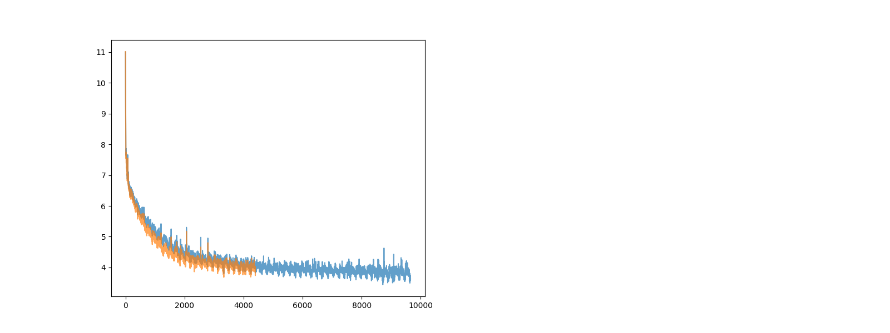

# gpt


```torchrun --standalone --nproc_per_node=1 train_gpt2_ben.py```

```pip freeze -l > requirements.txt```

```source setup.sh```

```screen -dm bash -c 'torchrun --standalone --nproc_per_node=1 train_gpt2.py > log/screen.txt 2>&1'```

```screen -dm bash -c 'torchrun --standalone --nproc_per_node=8 train_gpt2.py > log/screen.txt 2>&1'```

```screen -r```

```screen -dm bash -c 'torchrun --standalone --nproc_per_node=1 train_gpt2_ben.py > log/screen.txt 2>&1'```

Setup:

`pip3 install --pre torch torchvision torchaudio --index-url https://download.pytorch.org/whl/nightly/cu126`

## Notes

I suspect that additional noise will make training much worse... imagine a cryptographic notion, where I (the student) cannot distinguish between a correct answer and an incorrect answer, then of course, I cannot learn! Or, perhaps it takes many more samples for me to distinguish, then I will need substantially many more samples to learn, and perhaps this is compounded over time (not sure how the compounding works). So really, if we do introduce additional sources of loss, we should ensure that it is not noisy...

Let's say we introduce some RL notion, then it had better not be noisy. A data point should only "count" if it is "highly likely" to be correct. Perhaps we should only make it count if the model itself is highly confident in its assessment, and also penalize confident assessments somehow (or perhaps we don't need to do this, because it is already penalized via the ground truth training data: if it is confidently wrong, then it pushes down the score of the true correct answer, which pushes up the loss).

How do we distinguish between positive and negative assessments? Well, in a conversation, say I say something normal, and you reply with something completely out of left field, or completely wrong. Perhaps, in response, I should be exacerbated, or not know what to say? There is no longer a right answer in response to your "random response" (is there?). So perhaps if I am very confident in my reply, this is strong positive feedback. If I am not very confident in my reply at all, then there is no feedback (as opposed to strong negative feedback) because I don't want to introduce too much noise into the learning mechanism. 

So, `block_loss = -log(1 - pr[max])` (the lower the confidence, the closer the block_loss is to 0; the higher the confidence, the more negative the block_loss (so when added to the loss, the loss gets lower, which is "good").). (Or, do we want a good effect on loss. Negative here is good?) (Shouldn't we want some sort of negative feedback? Negative feedback perhaps only comes from the environment, and not from self learning. But i don't see why that has to be the case...)

Hmm, it still doesn't work very well. I don't see fundamental problems yet. Perhaps one fundamental problem is that the confidence is being pushed very high on early layers, with no bearing on the final layer that outputs. Then, we should maybe sample as soon as the confidence is high enough.


### Notes

##### 1-noise

The issue is that the block_loss was only slightly normalized (i.e. for each layer, -1 * crossentropy / n_layers), but this is still very noisy, so learning is not very good.

##### 2-test

In this one, we set `losses += _block_loss / self.config.n_layer`, where `_block_loss = F.cross_entropy(_logits.view(-1, _logits.size(-1)), _targets.view(-1))` and then `_block_loss = torch.log(1 - torch.exp(-1*_block_loss))`, namely it is positive feedback only. As we can see, it doesn't ever get to good training error, but better than noise.

##### 3-test

Somehow, we want to incentivize high confidence (else e.g. loss accumulates forever? Currently this won't successfuly do this incentivization) whilst penalizing wrong answers. When there is no environmental feedback, the loss should just be the self-confidence (i.e. high if high confidence?). Whenever confidence is high, there is some probability of terminating the line of thought (which is good), yet also a chance of accumulating loss in prior steps. Then model should learn to be confident early.

`loss_ = (xe * _confidence * _mask_BT).mean()`

If targets exist, for now we always multiply them in at every layer (even if it is not sampled). Consider not doing this (todo, is there a theoretical difference?).

##### 4-test

Now, we don't use the true loss against the true target until the network is actually ready to output the target:

```xe_factor = ((xe - 1) * _just_triggered + 1)
loss_ = (xe_factor * _confidence * _mask_BT).mean()
```

This certainly punishes confidence early on.


##### 5-test

Definitely punish confidently wrong answers. But what if there is no target? Ask the next layer if wrong or not wrong. If next layer is very confident, punish (as before), else no change to error. (Is that reasonable?) Fix a bug about asking the next layer for confidence, not the current one (whoops). Or should we reward confidence. (By my simulateability theory, predictable actions are not interesting to me. So if the robot's action was predictable to me, that action is not interesting. But this seems to be different. Note, there is also a distinction between predictability and distinguishability. Also, "did I expect this" from a verifier's point of view, is different from "would I have done the same thing", because note that in self talk, the answer to the latter is always "yes". Maybe heuristically, if I am highly confident, then I did expect it -- I know how to act in return to maximize the true reward; if I am not at all highly confident, then I did not expect the answer at all (it doesn't look like giberish either), and have no clue and no confidence in how to act. Thus, we should reward low confidence, or punish high confidence.)

```xe_factor_prev = ((_xe_prev - 1) * _just_triggered_prev + 1)
loss_ = (xe_factor_prev * _confidence * _mask_BT_prev).mean()
```

What incentivizes higher confidence? Earlier termination thus less loss. Maybe I should really penalize the last layer... Also, adding the additional cross_entropy calculition cost another .5 sec per step.

Result: 


(Strangely linear, but also outputs "the" a hundred times. On further debugging, penalizing confidence appears to cause this behavior. Why?)

##### 6-test

6-test-1: Rerun the "confidence of target" experiment with GPT learning rate.

Note that "0-noearly" is the same as vanilla GPT (but reusing weights) without our early termination mechanism (it is equal to "0-base"? Or does "0-base" have early termination?). "0-original" does not re-use any weights, and needs a smaller learning rate to converge properly. (It's odd that the behavior depends so thoroughly on the learning rate.) "0-gpt-custom" is the same as GPT but with our own code.

Things to try: reduce learning rate for some of the earlier experiments...

Does confidence reinforcement make sense? Recall what each layer does:

-- the attention module: each embedding is the weighted sum of multiple embeddings from the previous layer in its context window, computed according to some "attention matrix".

-- the MLP module is essentially a fact retrieval system; the 4A x A weight matrix + ReLU (or other non-linearity) can be (perhaps) thought of as evaluating a giant |4A|-number set of if statements on A-dimensional embeddings; the A x 4A projection matrix perhaps then "adds" facts to the original embedding (via the residual) depending on which "if statements" passed. (See 3Blue1Brown).

-- backprop "somehow" pushes the attention KVQ matrices, the if statements, and the facts, in the "correct" direction...

Our general hypothesis is that good training data is only one part of learning; acts of "self-reflection" or "self-consistency" are also very important to learning. (Somehow, the model should make two predictions and check whether they are consistent, or be able to evaluate its own quality/consistency indpendently of generating predictions.)

Note that the subsequent logit it generates is indeed such an assessment. Let us reward high confidence / penalize low confidence. (Is it an assessment? An embedding is a high-dimensional representation of a concept, or multiple concepts summed together, i.e. a thought; some may not be directly associated with single words, they may map to multiple words, and so forth... Confidence is just a measure of how they align with a specific english word.)

The problem is that...

A stream of   text that is
  
  of     text that is   next

  of     text that is   next


strangely, the third layer is guessing not the third layer, but continuing to guess the second layer... If i don't feed the residual back in after applying the attention layer, performance is hurt substantially. Why is the residual so important in that case? Is the (previous) embedding itself really a very deep short term memory? Why can't inclusion of the past be learned?

I guess because we add value matrices instead of the embedding itself, the past gets destroyed. (How necessary is the value matrix? Shouldn't the MLP setup deal with that already. Perhaps the value matrices should just be the embedding itself.)

Note that the residual connection and c_proj are extremey important, and I do not know why. The value matrix does not seem so important. (perhaps we can get rid of c_proj?)


A       stream of   text that is
  
stream  of     text that is   next
of      text   that is   next .

Alternatively, we can reward tokens that are equal to the next token in the previous layer.

##### 8-experiments

The probem with `res*attn2(x) + attn(x), x + mlp(LN(x))` seems to be that the residuals are blowing up the more we train it. Same with `res*attn2(x) + attn(x), x * mlp2(LN(x)) + mlp(LN(x))`.  (all layer loss)  We see residuals like

```SIZE COMPARISON prev 2.5294246673583984 next 1.1539545059204102
SIZE COMPARISON prev 2.8568525314331055 next 1.1331876516342163
SIZE COMPARISON prev 2.7836289405822754 next 1.121557354927063
SIZE COMPARISON prev 3.347931385040283 next 1.1270164251327515
SIZE COMPARISON prev 5.639773368835449 next 1.1290345191955566
SIZE COMPARISON prev 15.21493911743164 next 1.1317602396011353
SIZE COMPARISON prev 60.20911407470703 next 1.1316640377044678
SIZE COMPARISON prev 284.3788757324219 next 1.1313221454620361
SIZE COMPARISON prev 1445.6865234375 next 1.1314541101455688
SIZE COMPARISON prev 7582.7626953125 next 1.1323127746582031
SIZE COMPARISON prev 40300.05078125 next 1.133501410484314
SIZE COMPARISON prev 216047.5625 next 1.1349073648452759
```

For something like
`x = x + self.attn(x)  x = x + self.mlp(self.ln_2(x))` (all layer loss) (note, using x instead of res) we see residuals like

```
SIZE COMPARISON prev 18.42753028869629 next 0.8354735374450684
SIZE COMPARISON prev 12.65165901184082 next 0.8403578996658325
SIZE COMPARISON prev 12.434549331665039 next 0.8322869539260864
SIZE COMPARISON prev 13.066632270812988 next 0.8329403400421143
SIZE COMPARISON prev 12.981801986694336 next 0.8330138921737671
SIZE COMPARISON prev 12.918157577514648 next 0.8329639434814453
SIZE COMPARISON prev 12.923635482788086 next 0.8329555988311768
SIZE COMPARISON prev 12.929137229919434 next 0.8329416513442993
SIZE COMPARISON prev 12.931181907653809 next 0.832944393157959
SIZE COMPARISON prev 12.930807113647461 next 0.8329448699951172
SIZE COMPARISON prev 12.930171966552734 next 0.8329458236694336
SIZE COMPARISON prev 12.92995834350586 next 0.832942008972168
```

For vanilla GPT (as usual shared weights), all layer loss, we see by step 1100 (slowly shrinking over more steps)

```
SIZE COMPARISON prev 0.8780975341796875 next 1.1142359972000122
SIZE COMPARISON prev 1.2143694162368774 next 1.110939383506775
SIZE COMPARISON prev 1.652571439743042 next 1.1084067821502686
SIZE COMPARISON prev 2.119270086288452 next 1.1072710752487183
SIZE COMPARISON prev 2.6001691818237305 next 1.1067460775375366
SIZE COMPARISON prev 3.0836727619171143 next 1.1065006256103516
SIZE COMPARISON prev 3.564718246459961 next 1.1063616275787354
SIZE COMPARISON prev 4.042917251586914 next 1.1062694787979126
SIZE COMPARISON prev 4.51833438873291 next 1.1062010526657104
SIZE COMPARISON prev 4.991661548614502 next 1.1061511039733887
SIZE COMPARISON prev 5.463232040405273 next 1.1061171293258667
SIZE COMPARISON prev 5.933814525604248 next 1.1060969829559326
```

and by step 4250:

```SIZE COMPARISON prev 1.5941141843795776 next 1.3911638259887695
SIZE COMPARISON prev 2.485067367553711 next 1.3869950771331787
SIZE COMPARISON prev 3.4810280799865723 next 1.3849396705627441
SIZE COMPARISON prev 4.4364542961120605 next 1.3832675218582153
SIZE COMPARISON prev 5.394400596618652 next 1.3827459812164307
SIZE COMPARISON prev 6.328531265258789 next 1.3822684288024902
SIZE COMPARISON prev 7.25205135345459 next 1.3819595575332642
SIZE COMPARISON prev 8.162321090698242 next 1.381672739982605
SIZE COMPARISON prev 9.063191413879395 next 1.3814265727996826
SIZE COMPARISON prev 9.955363273620605 next 1.3812041282653809
SIZE COMPARISON prev 10.840224266052246 next 1.3810186386108398
SIZE COMPARISON prev 11.719019889831543 next 1.3808491230010986
```

Most of the contribution seems to come from the attention step. In particular e.g. by step 799 for the same experiment as above:

```
SIZE COMPARISON prev 0.9725479483604431 mid 0.05692768841981888 next 1.1076934337615967
SIZE COMPARISON prev 1.208902359008789 mid 1.1301352977752686 next 1.109763503074646
SIZE COMPARISON prev 1.4090938568115234 mid 1.3024053573608398 next 1.111130714416504
SIZE COMPARISON prev 1.5330252647399902 mid 1.396193027496338 next 1.1153910160064697
SIZE COMPARISON prev 1.7066140174865723 mid 1.5469791889190674 next 1.11979341506958
SIZE COMPARISON prev 2.1395297050476074 mid 1.9626308679580688 next 1.1215941905975342
SIZE COMPARISON prev 3.0498666763305664 mid 2.85837459564209 next 1.1217771768569946
SIZE COMPARISON prev 4.754446029663086 mid 4.55536413192749 next 1.1214094161987305
SIZE COMPARISON prev 7.8321757316589355 mid 7.630302429199219 next 1.121267318725586
SIZE COMPARISON prev 13.233830451965332 mid 13.03246784210205 next 1.1213200092315674
SIZE COMPARISON prev 22.627168655395508 mid 22.428388595581055 next 1.1217448711395264
SIZE COMPARISON prev 38.77415466308594 mid 38.57970428466797 next 1.1223392486572266
```

Next, we see if layernorm learnable scale/shift parameters are actualy necessary. Probably not! For res + attn(x), without learnable parameters, by step 499:

```
SIZE COMPARISON prev 1.3563252687454224 mid 0.4865388572216034 next 1.0006482601165771
SIZE COMPARISON prev 1.7924420833587646 mid 1.4573729038238525 next 1.0006499290466309
SIZE COMPARISON prev 2.284381628036499 mid 1.9278755187988281 next 1.0006506443023682
SIZE COMPARISON prev 2.821475028991699 mid 2.4290308952331543 next 1.0006510019302368
SIZE COMPARISON prev 3.3831615447998047 mid 2.9755988121032715 next 1.000651240348816
SIZE COMPARISON prev 3.9586188793182373 mid 3.545346736907959 next 1.0006513595581055
SIZE COMPARISON prev 4.539757251739502 mid 4.125799179077148 next 1.000651478767395
SIZE COMPARISON prev 5.122259140014648 mid 4.709800720214844 next 1.0006515979766846
SIZE COMPARISON prev 5.703899383544922 mid 5.293674945831299 next 1.0006515979766846
SIZE COMPARISON prev 6.283486843109131 mid 5.875919342041016 next 1.0006515979766846
SIZE COMPARISON prev 6.860944747924805 mid 6.455946922302246 next 1.0006515979766846
SIZE COMPARISON prev 7.435906887054443 mid 7.033243179321289 next 1.0006515979766846
```


If we use res*attn(x), weirdly (and as previously seen), the residuals blow up. For LN without learnable parameters (everylayer loss, shared weights), by step 3800:

```
SIZE COMPARISON prev 0.9520694017410278 mid 0.05660898983478546 next 1.0006455183029175
SIZE COMPARISON prev 1.1140660047531128 mid 1.0007506608963013 next 1.0006468296051025
SIZE COMPARISON prev 1.1631948947906494 mid 0.9358635544776917 next 1.000647783279419
SIZE COMPARISON prev 2.937286853790283 mid 2.5033302307128906 next 1.0006508827209473
SIZE COMPARISON prev 23.77895736694336 mid 23.278114318847656 next 1.0006515979766846
SIZE COMPARISON prev 211.52383422851562 mid 211.03501892089844 next 1.0006515979766846
SIZE COMPARISON prev 1932.359130859375 mid 1931.881103515625 next 1.0006515979766846
SIZE COMPARISON prev 17739.107421875 mid 17738.642578125 next 1.0006515979766846
SIZE COMPARISON prev 162568.78125 mid 162568.328125 next 1.0006515979766846
SIZE COMPARISON prev 1477890.75 mid 1477890.25 next 1.0006515979766846
SIZE COMPARISON prev 13287474.0 mid 13287474.0 next 1.0006515979766846
SIZE COMPARISON prev 117777120.0 mid 117777120.0 next 1.0006515979766846
```

Perhaps this means that attn(x) outputs very small numbers, and they are trying to compensate... generally very confusing.


I wonder if res + attn(ln(res)) is at heart performing a "substitutition" into res. And x + mlp(ln(x)) evaluates an if statement and... maybe it should be

```y = res + attn(ln(res))
x = x + mlp(ln(y))
```

and we don't add y back in?

Well, it turns out this sucks, similarly to x = x + attn(x):


What about

```y = res + attn(ln(res))
x = res + mlp(ln(y))
```

well:


(performance seems truly worse) so it is really quite important that the logits directly get the output of the attention layer (instead of solely feeding the attention layer into the mlp and then the output).

Note that for double attention `res*attn2(x) + attn(x), x + mlp(LN(x))`, the residuals still blow up:

```
@ 949 train 5.2751 , allloss: 64.1261, confloss: 0.0000, targetloss: 0.0000, earlystop: 0.000, earlystopdict: [0.0, 0.0, 0.0, 0.0, 0.0, 0.0, 0.0, 0.0, 0.0, 0.0, 0.0, 0.0], lr:5.9999e-04, norm:7.9968, dt: 1769.77ms, tok/sec: 74061.71, flops:30.47, batch-reuse:1
SIZE COMPARISON prev 1.0659868717193604 next 1.0947023630142212
SIZE COMPARISON prev 1.798586368560791 next 1.1034561395645142
SIZE COMPARISON prev 2.1790177822113037 next 1.107276439666748
SIZE COMPARISON prev 2.6335883140563965 next 1.105468511581421
SIZE COMPARISON prev 4.98344612121582 next 1.1039302349090576
SIZE COMPARISON prev 14.011809349060059 next 1.1064351797103882
SIZE COMPARISON prev 56.432098388671875 next 1.106866478919983
SIZE COMPARISON prev 249.68592834472656 next 1.1070586442947388
SIZE COMPARISON prev 1164.308837890625 next 1.1072487831115723
SIZE COMPARISON prev 5611.69482421875 next 1.1074464321136475
SIZE COMPARISON prev 27626.546875 next 1.1076771020889282
SIZE COMPARISON prev 138020.09375 next 1.1078872680664062
```

For `res + attn(x), x * mlp(LN(x))`, it still blows up, but a little slower:

```
@ 949 train 5.3970 , allloss: 65.0632, confloss: 0.0000, targetloss: 0.0000, earlystop: 0.000, earlystopdict: [0.0, 0.0, 0.0, 0.0, 0.0, 0.0, 0.0, 0.0, 0.0, 0.0, 0.0, 0.0], lr:5.9999e-04, norm:8.4142, dt: 1606.70ms, tok/sec: 81578.15, flops:35.93, batch-reuse:1
SIZE COMPARISON prev 0.6984971761703491 mid 0.6713976860046387 next 1.0006380081176758
SIZE COMPARISON prev 0.9332523345947266 mid 0.7942314147949219 next 1.0006457567214966
SIZE COMPARISON prev 1.5732736587524414 mid 1.0734591484069824 next 1.0006494522094727
SIZE COMPARISON prev 2.531172752380371 mid 1.7262670993804932 next 1.0006508827209473
SIZE COMPARISON prev 4.456131935119629 mid 2.7139768600463867 next 1.0006513595581055
SIZE COMPARISON prev 7.704921245574951 mid 4.647169589996338 next 1.0006515979766846
SIZE COMPARISON prev 14.081094741821289 mid 7.897726058959961 next 1.0006515979766846
SIZE COMPARISON prev 25.32900619506836 mid 14.263557434082031 next 1.0006515979766846
SIZE COMPARISON prev 47.37249755859375 mid 25.50238800048828 next 1.0006515979766846
SIZE COMPARISON prev 87.77811431884766 mid 47.53529357910156 next 1.0006515979766846
SIZE COMPARISON prev 166.31536865234375 mid 87.93147277832031 next 1.0006515979766846
SIZE COMPARISON prev 313.864501953125 mid 166.46051025390625 next 1.0006515979766846
...
@ 3499 train 4.1087 , allloss: 50.1864, confloss: 0.0000, targetloss: 0.0000, earlystop: 0.000, earlystopdict: [0.0, 0.0, 0.0, 0.0, 0.0, 0.0, 0.0, 0.0, 0.0, 0.0, 0.0, 0.0], lr:5.9982e-04, norm:7.7492, dt: 1606.40ms, tok/sec: 81593.42, flops:35.93, batch-reuse:1
SIZE COMPARISON prev 0.9271938800811768 mid 0.6703000068664551 next 1.000638723373413
SIZE COMPARISON prev 1.5912479162216187 mid 1.1378358602523804 next 1.000647783279419
SIZE COMPARISON prev 2.6288633346557617 mid 1.8008546829223633 next 1.0006506443023682
SIZE COMPARISON prev 7.2939934730529785 mid 2.786419630050659 next 1.0006515979766846
SIZE COMPARISON prev 53.24920654296875 mid 7.418212890625 next 1.0006517171859741
SIZE COMPARISON prev 499.09014892578125 mid 53.380401611328125 next 1.0006515979766846
SIZE COMPARISON prev 4886.146484375 mid 499.2305908203125 next 1.0006515979766846
SIZE COMPARISON prev 48644.1953125 mid 4886.2861328125 next 1.0006517171859741
SIZE COMPARISON prev 489250.40625 mid 48644.3359375 next 1.0006515979766846
SIZE COMPARISON prev 4965097.5 mid 489250.53125 next 1.0006515979766846
SIZE COMPARISON prev 50753656.0 mid 4965097.5 next 1.0006515979766846
SIZE COMPARISON prev 521954624.0 mid 50753656.0 next 1.0006515979766846
```

What about

```y = res + attn(ln(res))
x = y + mlp(ln(res))
```

i.e. how important is it that the output of attention gets fed into the MLP? It turns out, this works surprisingly well; i.e. attention and MLP both seem to be additive, *independent* components:


```
@ 4099 train 4.1100 , allloss: 50.7263, confloss: 0.0000, targetloss: 0.0000, earlystop: 0.000, earlystopdict: [0.0, 0.0, 0.0, 0.0, 0.0, 0.0, 0.0, 0.0, 0.0, 0.0, 0.0, 0.0], lr:5.9975e-04, norm:4.9580, dt: 1626.09ms, tok/sec: 80605.68, flops:35.50, batch-reuse:1
SIZE COMPARISON prev 1.7276793718338013 mid 0.828337550163269 next 1.0006475448608398
SIZE COMPARISON prev 2.3453421592712402 mid 1.9509013891220093 next 1.0006494522094727
SIZE COMPARISON prev 3.0417964458465576 mid 2.5768418312072754 next 1.0006505250930786
SIZE COMPARISON prev 3.7537474632263184 mid 3.24953031539917 next 1.0006508827209473
SIZE COMPARISON prev 4.469127655029297 mid 3.953681230545044 next 1.0006511211395264
SIZE COMPARISON prev 5.175540447235107 mid 4.6598124504089355 next 1.0006513595581055
SIZE COMPARISON prev 5.872206687927246 mid 5.358777046203613 next 1.0006513595581055
SIZE COMPARISON prev 6.5586748123168945 mid 6.048742294311523 next 1.000651478767395
SIZE COMPARISON prev 7.23720645904541 mid 6.730024337768555 next 1.0006515979766846
SIZE COMPARISON prev 7.907989501953125 mid 7.40459680557251 next 1.0006515979766846
SIZE COMPARISON prev 8.572383880615234 mid 8.07198715209961 next 1.0006515979766846
SIZE COMPARISON prev 9.231319427490234 mid 8.7335205078125 next 1.0006515979766846
```

Note that the above doesn't matter if we change the order of mlp and attn, namely

```y = res + mlp(ln(res))
x = y + attn(ln(res))
```

is equivalent.

What happens if we remove the "all layer loss", and compute loss as per the usual method?



It is in fact, better; the all layer loss is utterly useless.

But note that the std does not blow up as much, weirdly:

```
@ 4399 train 3.7913 , allloss: 3.7913, confloss: 0.0000, targetloss: 0.0000, earlystop: 0.000, earlystopdict: [0.0, 0.0, 0.0, 0.0, 0.0, 0.0, 0.0, 0.0, 0.0, 0.0, 0.0, 0.0], lr:5.9971e-04, norm:0.6440, dt: 411.78ms, tok/sec: 318308.01, flops:140.18, batch-reuse:1
SIZE COMPARISON prev 2.829397439956665 mid 2.238248825073242 next 1.0006511211395264
SIZE COMPARISON prev 2.9154844284057617 mid 2.7668395042419434 next 1.0006510019302368
SIZE COMPARISON prev 2.937965154647827 mid 2.9097206592559814 next 1.0006510019302368
SIZE COMPARISON prev 2.847860336303711 mid 2.835615634918213 next 1.0006510019302368
SIZE COMPARISON prev 2.772952079772949 mid 2.7625179290771484 next 1.0006508827209473
SIZE COMPARISON prev 2.7469887733459473 mid 2.7138304710388184 next 1.0006508827209473
SIZE COMPARISON prev 2.775296211242676 mid 2.707706928253174 next 1.0006508827209473
SIZE COMPARISON prev 2.8555359840393066 mid 2.748220682144165 next 1.0006508827209473
SIZE COMPARISON prev 2.987206220626831 mid 2.838392496109009 next 1.0006510019302368
SIZE COMPARISON prev 3.1633992195129395 mid 2.9731945991516113 next 1.0006511211395264
SIZE COMPARISON prev 3.425197124481201 mid 3.1695663928985596 next 1.000651240348816
SIZE COMPARISON prev 3.9492619037628174 mid 3.533745765686035 next 1.0006513595581055
```

What happens if we 2x the attention component?


```
@ 2449 train 4.2471 , allloss: 4.2471, confloss: 0.0000, targetloss: 0.0000, earlystop: 0.000, earlystopdict: [0.0, 0.0, 0.0, 0.0, 0.0, 0.0, 0.0, 0.0, 0.0, 0.0, 0.0, 0.0], lr:5.9991e-04, norm:0.7454, dt: 411.36ms, tok/sec: 318631.23, flops:140.32, batch-reuse:1
SIZE COMPARISON prev 3.474045753479004 mid 2.998915672302246 next 1.0006513595581055
SIZE COMPARISON prev 3.860865592956543 mid 3.8047633171081543 next 1.0006513595581055
SIZE COMPARISON prev 3.176105499267578 mid 3.17417573928833 next 1.0006511211395264
SIZE COMPARISON prev 2.7696032524108887 mid 2.7842602729797363 next 1.0006510019302368
SIZE COMPARISON prev 2.601201057434082 mid 2.6080410480499268 next 1.0006508827209473
SIZE COMPARISON prev 2.55460524559021 mid 2.5488529205322266 next 1.0006508827209473
SIZE COMPARISON prev 2.535594940185547 mid 2.500566244125366 next 1.0006508827209473
SIZE COMPARISON prev 2.5360474586486816 mid 2.458188056945801 next 1.0006508827209473
SIZE COMPARISON prev 2.598814010620117 mid 2.465818405151367 next 1.0006508827209473
SIZE COMPARISON prev 2.779794216156006 mid 2.578892707824707 next 1.0006510019302368
SIZE COMPARISON prev 3.112057685852051 mid 2.8377723693847656 next 1.0006511211395264
SIZE COMPARISON prev 3.612070083618164 mid 3.259913444519043 next 1.0006513595581055
```

It is worse... why? But it eventually converges, so it doesn't really matter. What if we 0.5x it?


```
@ 1999 train 4.1020 , allloss: 4.1020, confloss: 0.0000, targetloss: 0.0000, earlystop: 0.000, earlystopdict: [0.0, 0.0, 0.0, 0.0, 0.0, 0.0, 0.0, 0.0, 0.0, 0.0, 0.0, 0.0], lr:5.9994e-04, norm:0.6649, dt: 422.70ms, tok/sec: 310084.43, flops:136.56, batch-reuse:1
val: loaded 100000000 tokens (first shard)
val: 1 epoch (1 shard) = 12207 mini-batches
validation loss: 4.2778
SIZE COMPARISON prev 1.7215176820755005 mid 1.1063441038131714 next 1.0006499290466309
SIZE COMPARISON prev 2.114750385284424 mid 1.966301441192627 next 1.0006506443023682
SIZE COMPARISON prev 1.981388807296753 mid 2.1172070503234863 next 1.0006502866744995
SIZE COMPARISON prev 1.8269994258880615 mid 1.9413310289382935 next 1.00065016746521
SIZE COMPARISON prev 1.6911734342575073 mid 1.7758653163909912 next 1.0006499290466309
SIZE COMPARISON prev 1.6034241914749146 mid 1.6564953327178955 next 1.0006498098373413
SIZE COMPARISON prev 1.5692648887634277 mid 1.589362621307373 next 1.0006496906280518
SIZE COMPARISON prev 1.5858174562454224 mid 1.5691030025482178 next 1.0006496906280518
SIZE COMPARISON prev 1.6530719995498657 mid 1.5916287899017334 next 1.0006498098373413
SIZE COMPARISON prev 1.7865718603134155 mid 1.6776154041290283 next 1.0006500482559204
SIZE COMPARISON prev 2.007704973220825 mid 1.845852017402649 next 1.000650405883789
SIZE COMPARISON prev 2.3220303058624268 mid 2.0987911224365234 next 1.0006507635116577
```

It is identical... So it seems that attention is not particularly useful for early gains; it's really the MLP that matters. If we skip out on attention completely:


```
@ 1699 train 5.8143 , allloss: 5.8143, confloss: 0.0000, targetloss: 0.0000, earlystop: 0.000, earlystopdict: [0.0, 0.0, 0.0, 0.0, 0.0, 0.0, 0.0, 0.0, 0.0, 0.0, 0.0, 0.0], lr:5.9996e-04, norm:0.2052, dt: 272.28ms, tok/sec: 481386.85, flops:212.00, batch-reuse:1
SIZE COMPARISON prev 3.032069206237793 mid 0.034484002739191055 next 1.0006475448608398
SIZE COMPARISON prev 4.604878902435303 mid 3.032069206237793 next 1.0006513595581055
SIZE COMPARISON prev 4.4857869148254395 mid 4.604878902435303 next 1.0006513595581055
SIZE COMPARISON prev 4.478532791137695 mid 4.4857869148254395 next 1.0006513595581055
SIZE COMPARISON prev 4.600770473480225 mid 4.478532791137695 next 1.000651478767395
SIZE COMPARISON prev 4.848290920257568 mid 4.600770473480225 next 1.0006513595581055
SIZE COMPARISON prev 5.205094337463379 mid 4.848290920257568 next 1.0006513595581055
SIZE COMPARISON prev 5.654345989227295 mid 5.205094337463379 next 1.0006515979766846
SIZE COMPARISON prev 6.184695720672607 mid 5.654345989227295 next 1.0006513595581055
SIZE COMPARISON prev 6.788667678833008 mid 6.184695720672607 next 1.000651478767395
SIZE COMPARISON prev 7.458611965179443 mid 6.788667678833008 next 1.0006515979766846
SIZE COMPARISON prev 8.18480110168457 mid 7.458611965179443 next 1.0006517171859741
```

It is worse! Whew. Our efforts are validted. But note that the residual still grows... Here, prev is the size of newres, x is the size of ln(prev), and mid is the size of prevres (as opposed to prevres + attn). So MLP is definitely adding a component (perhaps over and over again). 


What happens (for fun) if we do `y = res  + self.attn(x)*self.mlp(x)`:


```
@ 6349 train 3.8610 , allloss: 3.8610, confloss: 0.0000, targetloss: 0.0000, earlystop: 0.000, earlystopdict: [0.0, 0.0, 0.0, 0.0, 0.0, 0.0, 0.0, 0.0, 0.0, 0.0, 0.0, 0.0], lr:5.9941e-04, norm:0.7167, dt: 409.91ms, tok/sec: 319757.28, flops:140.82, batch-reuse:1
SIZE COMPARISON prev 4.092894554138184 mid 4.092894554138184 next 1.0006513595581055
SIZE COMPARISON prev 4.809565544128418 mid 4.809565544128418 next 1.0006513595581055
SIZE COMPARISON prev 4.6843671798706055 mid 4.6843671798706055 next 1.0006513595581055
SIZE COMPARISON prev 4.60699462890625 mid 4.60699462890625 next 1.0006513595581055
SIZE COMPARISON prev 4.567028999328613 mid 4.567028999328613 next 1.0006513595581055
SIZE COMPARISON prev 4.567410945892334 mid 4.567410945892334 next 1.0006513595581055
SIZE COMPARISON prev 4.6050896644592285 mid 4.6050896644592285 next 1.0006513595581055
SIZE COMPARISON prev 4.691596508026123 mid 4.691596508026123 next 1.000651478767395
SIZE COMPARISON prev 4.89960241317749 mid 4.89960241317749 next 1.0006513595581055
SIZE COMPARISON prev 5.414493083953857 mid 5.414493083953857 next 1.0006515979766846
SIZE COMPARISON prev 6.540674686431885 mid 6.540674686431885 next 1.0006515979766846
SIZE COMPARISON prev 8.01706314086914 mid 8.01706314086914 next 1.0006517171859741
rank 0 sample 0: A Poem for you! Roses are red, Potatoes are 
```

It seems to be the best yet.

What happens if we only feed in `attn(x) + mlp(x)` into the attn and mlp components of the next layer, and not the res? (This one crashes).

What happens if we remove the value matrix, and instead just use the identity matrix, and them sum together the output of all of the heads?


```
@ 4699 train 3.9265 , allloss: 3.9265, confloss: 0.0000, targetloss: 0.0000, earlystop: 0.000, earlystopdict: [0.0, 0.0, 0.0, 0.0, 0.0, 0.0, 0.0, 0.0, 0.0, 0.0, 0.0, 0.0], lr:5.9967e-04, norm:0.6336, dt: 1324.04ms, tok/sec: 98993.98, flops:42.88, batch-reuse:1
INFO nextres 33.397308349609375 attn*mlp 33.40809631347656 layernormed 1.0006517171859741
	 attn_hist -29.4375<tensor([ 45., 134., 166., 263., 119.,  41.])>29.25 mlp_hist -10.4375<tensor([ 24., 123., 402., 207.,  10.,   2.], dtype=torch.bfloat16)>15.0625
INFO nextres 193.25694274902344 attn*mlp 195.94659423828125 layernormed 1.0006517171859741
	 attn_hist -75.375<tensor([  1.,  11., 467., 249.,  38.,   2.])>72.75 mlp_hist -58.5<tensor([ 74., 122., 255., 280.,  33.,   5.], dtype=torch.bfloat16)>80.0
INFO nextres 120.01077270507812 attn*mlp 82.8893814086914 layernormed 1.0006517171859741
	 attn_hist -52.5<tensor([ 14., 545., 197.,  10.,   1.,   1.])>116.25 mlp_hist -18.125<tensor([  7.,   3., 272., 278., 190.,  17.], dtype=torch.bfloat16)>6.28125
INFO nextres 71.63121032714844 attn*mlp 55.632476806640625 layernormed 1.0006517171859741
	 attn_hist -45.75<tensor([ 14., 526., 212.,  12.,   2.,   2.])>102.75 mlp_hist -13.0625<tensor([  7.,  24., 362., 226., 137.,  12.], dtype=torch.bfloat16)>5.21875
INFO nextres 44.969993591308594 attn*mlp 30.2081298828125 layernormed 1.0006517171859741
	 attn_hist -49.875<tensor([  8., 436., 308.,  12.,   2.,   2.])>106.5 mlp_hist -7.6875<tensor([ 11., 276., 183., 214.,  74.,  10.], dtype=torch.bfloat16)>3.8125
INFO nextres 29.09838104248047 attn*mlp 18.429052352905273 layernormed 1.0006517171859741
	 attn_hist -45.375<tensor([ 27., 598., 130.,  10.,   1.,   2.])>109.5 mlp_hist -4.8125<tensor([155., 192., 158., 181.,  71.,  11.], dtype=torch.bfloat16)>2.78125
INFO nextres 19.71997833251953 attn*mlp 12.138340950012207 layernormed 1.0006517171859741
	 attn_hist -35.8125<tensor([132., 586.,  42.,   6.,   1.,   1.])>112.5 mlp_hist -3.65625<tensor([210., 152., 167., 177.,  56.,   6.], dtype=torch.bfloat16)>2.609375
INFO nextres 15.027619361877441 attn*mlp 7.450224876403809 layernormed 1.0006517171859741
	 attn_hist -34.5<tensor([121., 542.,  94.,   9.,   1.,   1.])>99.0 mlp_hist -3.25<tensor([166., 180., 143., 212.,  57.,  10.], dtype=torch.bfloat16)>2.09375
INFO nextres 13.641393661499023 attn*mlp 5.161359786987305 layernormed 1.0006517171859741
	 attn_hist -36.75<tensor([ 47., 202., 477.,  38.,   2.,   2.])>73.875 mlp_hist -3.1875<tensor([ 13., 253., 178., 238.,  70.,  16.], dtype=torch.bfloat16)>1.609375
INFO nextres 15.402214050292969 attn*mlp 6.81701135635376 layernormed 1.0006517171859741
	 attn_hist -36.5625<tensor([ 28., 136., 418., 123.,  58.,   5.])>44.25 mlp_hist -4.125<tensor([  4.,  26.,  81., 354., 270.,  33.], dtype=torch.bfloat16)>1.5703125
INFO nextres 19.019399642944336 attn*mlp 8.641536712646484 layernormed 1.0006517171859741
	 attn_hist -30.0<tensor([ 65., 130., 418.,  95.,  55.,   5.])>43.5 mlp_hist -5.03125<tensor([ 24., 156., 308.,  90., 113.,  78.], dtype=torch.bfloat16)>5.65625
INFO nextres 20.741458892822266 attn*mlp 7.100666046142578 layernormed 1.0006517171859741
	 attn_hist -34.3125<tensor([ 21., 186., 411., 108.,  38.,   4.])>50.625 mlp_hist -5.34375<tensor([ 23., 328., 159.,  73.,  66., 120.], dtype=torch.bfloat16)>8.1875
```

It is almost as good, but definitely not as good (I wonder if because we got rid of that one projection matrix).


Recall that in combinator calculuses, we need to be able to (1) copy arguments (inverting this operation is kind of the point of compression / learning a computation) and (2) apply arguments to each other (programmability). When inverting, I suspect it is just pattern match replacement (is this the MLP). Magnitude is somehow important for the encoding. Attention combines tokens into single embeddings? Is this some manifestation of programmability. Or, is everything truly in the forward direction. Attention takes a weighted sum of prior tokens.

Somehow, addition feels like an application / one-step evaluation / perhaps it refers to the depth of the tree, and each embedding dimension is like a possible subtree at each level. Or does attention give tree structure.

Somehow, a sequence of embeddings represents code. The attention component learns how individual tokens (read subtrees) programmatically act on other tokens (other subtrees). (But what is this value matrix?) Note that addition does not distinguish between left and right subtrees, or have an order, so how do we deal with it...  


General framework:
- Backprop performs memorization of substitution rules.
- regularization through LN limits "how much" we can memorize (limiting standard deviation).
- forward pass performs the actual computation.

Try again:
- the embedding itself encodes things like its position in the tree... and also its subtree... which is itself a sum of embeddings... (how is this possible? We only give it a 1D positional embedding.)
- The MLP maps nodes (i.e. subtrees) to compressed inverses.
- Attention then joins more nodes together as appropriate. (Why not join all nodes together? Well, maybe MLP cannot distinguish such a big sum? It shouldn't actually matter..., MLP should be able to distinguish. So why?) (If we sum everything together at every T, then the MLP triggers for every location T.) So somehow, we want the MLP to trigger selectively and in the right order.

But how come the MLP can't pick out specific patterns by itself? Why does it need the attention... what does element-wise multiplication mean, between two embeddings? A masked embedding? Attention is the mask (does it generate only boolean outputs)? MLP is the mask? why do we need to mask  the output of the mlp? What does magnitude of embedding mean?

An embedding does not see its sibling trees. Attention computes (given the embeddings) which  other nodes each on acts on / is connected to, outputting a parent node (the sum of the child nodes). The MLP layer takes as input an embedding (subtree) and inverts it (ideally to something more compressed). But the result is added on. Why is it added on? It should instead replace the embedding (but maybe not the whole thing, of only a subtree was inverted?)


Question:

what happens if i backprop every layer, but only propagate the gradient one layer

termination when it no longer updates / when it converges


## On Backprop

Note that the all_layer generally does seem slightly worse. For instance:

```testname = "10-resmlp-single-axm-novalue-copy-alllayer"
basename = "10-resmlp-single-axm-novalue"
```


With all-layer loss, the mlp size does seem smaller, and the graphs seemed more centered.

Let us now try it without deep propagation, i.e. all layer but only propagating the gradient one step:


## RMSNorm

Now, going bak to single layer loss, using the axm architecture, what does it look like with RMSNorm?


## On MLP

One hypothesis is that the MLP performs a copy of the embedding in a memorized location, i.e. it rotates it, or adds a positional embedding (and maybe this is why the residual is important?)

Try MLP(x+LN(y))